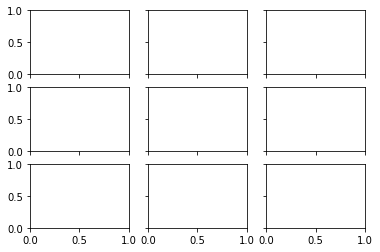

```python
d=dict(sdf=4)
```


```python
def f(**d): 
    return d
```


```python
f(**d)
```


    {'sdf': 4}


```python
l=[[1,2,3]]
```


```python
np.ndarray.flatten(np.ndarray(l))
```


    ---------------------------------------------------------------------------

    TypeError                                 Traceback (most recent call last)

    <ipython-input-8-b4699665215a> in <module>
    ----> 1 np.ndarray.flatten(np.ndarray(l))
    

    TypeError: 'list' object cannot be interpreted as an integer


```python
list(matplotlib.cbook.flatten(l))
```


    [1, 2, 3]


```python
nc = 8 
```


```python

```


```python

```


```python
cols
```


    3


```python
fig,axs = plt.subplots(rows,cols,sharey=True,sharex=True,)
```





```python
fig.add_subplot(5,4,1)
```


    <matplotlib.axes._subplots.AxesSubplot at 0x1c2214aba8>


```python
sns.choose_colorbrewer_palette('q')
```


    interactive(children=(Dropdown(description='name', options=('Set1', 'Set2', 'Set3', 'Paired', 'Accent', 'Paste…


    [(0.8941176470588235, 0.10196078431372557, 0.10980392156862737),
     (0.21568627450980393, 0.4941176470588236, 0.7215686274509804),
     (0.3019607843137256, 0.6862745098039216, 0.29019607843137263),
     (0.5960784313725492, 0.3058823529411765, 0.6392156862745098),
     (1.0, 0.4980392156862745, 0.0),
     (0.9999999999999998, 1.0, 0.19999999999999996),
     (0.6509803921568629, 0.33725490196078434, 0.1568627450980391),
     (0.9686274509803922, 0.5058823529411766, 0.7490196078431374),
     (0.6, 0.6, 0.6)]


```python

```
