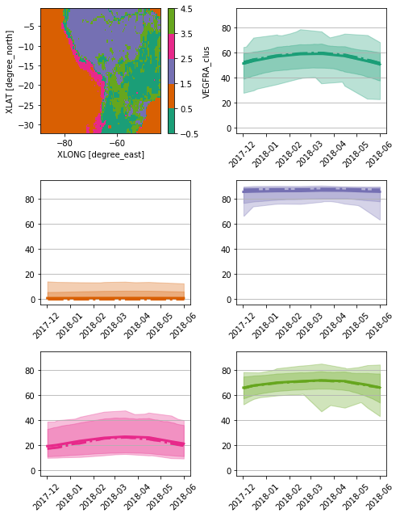

```python
%load_ext autoreload
```


```python
%autoreload 2
```


```python
from useful_scit.imps import *
import check_input_01_funs as pp
from check_input_01_funs import *
```


```python
path = '/Volumes/mbProD/Downloads/wrf_small_files'
```


```python
glob.glob(path+'/wrf*')
```


    []


```python
file_path = os.path.join(path,'wrflowinp_d01')
```


```python
xa = xr.open_dataset(file_path)
```


    ---------------------------------------------------------------------------

    KeyError                                  Traceback (most recent call last)

    ~/miniconda3/envs/b36/lib/python3.6/site-packages/xarray/backends/file_manager.py in acquire(self, needs_lock)
        166             try:
    --> 167                 file = self._cache[self._key]
        168             except KeyError:


    ~/miniconda3/envs/b36/lib/python3.6/site-packages/xarray/backends/lru_cache.py in __getitem__(self, key)
         41         with self._lock:
    ---> 42             value = self._cache[key]
         43             self._cache.move_to_end(key)


    KeyError: [<function _open_netcdf4_group at 0x11241d510>, ('/Volumes/mbProD/Downloads/wrf_small_files/wrflowinp_d01', CombinedLock([<unlocked _thread.lock object at 0x1124024b8>, <unlocked _thread.lock object at 0x1124024e0>])), 'r', (('clobber', True), ('diskless', False), ('format', 'NETCDF4'), ('group', None), ('persist', False))]

    
    During handling of the above exception, another exception occurred:


    FileNotFoundError                         Traceback (most recent call last)

    <ipython-input-7-44c508175dca> in <module>
    ----> 1 xa = xr.open_dataset(file_path)
    

    ~/miniconda3/envs/b36/lib/python3.6/site-packages/xarray/backends/api.py in open_dataset(filename_or_obj, group, decode_cf, mask_and_scale, decode_times, autoclose, concat_characters, decode_coords, engine, chunks, lock, cache, drop_variables, backend_kwargs, use_cftime)
        361         if engine == 'netcdf4':
        362             store = backends.NetCDF4DataStore.open(
    --> 363                 filename_or_obj, group=group, lock=lock, **backend_kwargs)
        364         elif engine == 'scipy':
        365             store = backends.ScipyDataStore(filename_or_obj, **backend_kwargs)


    ~/miniconda3/envs/b36/lib/python3.6/site-packages/xarray/backends/netCDF4_.py in open(cls, filename, mode, format, group, clobber, diskless, persist, lock, lock_maker, autoclose)
        350             kwargs=dict(group=group, clobber=clobber, diskless=diskless,
        351                         persist=persist, format=format))
    --> 352         return cls(manager, lock=lock, autoclose=autoclose)
        353 
        354     @property


    ~/miniconda3/envs/b36/lib/python3.6/site-packages/xarray/backends/netCDF4_.py in __init__(self, manager, lock, autoclose)
        309 
        310         self._manager = manager
    --> 311         self.format = self.ds.data_model
        312         self._filename = self.ds.filepath()
        313         self.is_remote = is_remote_uri(self._filename)


    ~/miniconda3/envs/b36/lib/python3.6/site-packages/xarray/backends/netCDF4_.py in ds(self)
        354     @property
        355     def ds(self):
    --> 356         return self._manager.acquire().value
        357 
        358     def open_store_variable(self, name, var):


    ~/miniconda3/envs/b36/lib/python3.6/site-packages/xarray/backends/file_manager.py in acquire(self, needs_lock)
        171                     kwargs = kwargs.copy()
        172                     kwargs['mode'] = self._mode
    --> 173                 file = self._opener(*self._args, **kwargs)
        174                 if self._mode == 'w':
        175                     # ensure file doesn't get overriden when opened again


    ~/miniconda3/envs/b36/lib/python3.6/site-packages/xarray/backends/netCDF4_.py in _open_netcdf4_group(filename, lock, mode, group, **kwargs)
        242     import netCDF4 as nc4
        243 
    --> 244     ds = nc4.Dataset(filename, mode=mode, **kwargs)
        245 
        246     with close_on_error(ds):


    netCDF4/_netCDF4.pyx in netCDF4._netCDF4.Dataset.__init__()


    netCDF4/_netCDF4.pyx in netCDF4._netCDF4._ensure_nc_success()


    FileNotFoundError: [Errno 2] No such file or directory: b'/Volumes/mbProD/Downloads/wrf_small_files/wrflowinp_d01'


```python
plot_lowinp_pars(xa)
```


SST show issues:
- min<220 K 
- max>320 K


```python
file_input = os.path.join(path,'wrfinput_d01')
xa_low = import_lowinp(file_path,file_input)
```


```python
p = 'SST'
p_c = p+'_clus'
nc = 7
cols = 2
plot_clus_sig(xa_low,p,p_c,nc,cols=2)
```


```python
p = 'SEAICE'
p_c = p+'_clus'
nc = 2
cols = 2
plot_clus_sig(xa_low,p,p_c,nc,cols=2)
```


```python
p = 'VEGFRA'
p_c = p+'_clus'
nc = 5
cols = 2
plot_clus_sig(xa_low,p,p_c,nc,cols=2)
```





```python
p = 'LAI'
p_c = p+'_clus'
nc = 6
cols = 2
plot_clus_sig(xa_low,p,p_c,nc,cols=2)
```


```python
x1 = xa_low.where(xa_low.LAKEMASK==1)
p = 'SST'
nc = 6
p_c = p+'_clus_lake'
cols = 2
plot_clus_sig(x1,p,p_c,nc,cols=2)
```


```python
x1 = xa_low.where(xa_low.LAKEMASK==1)
p = 'SEAICE'
nc = 2
p_c = p+'_clus_lake'
cols = 2
plot_clus_sig(x1,p,p_c,nc,cols=2)
```


```python
xaIce = xa.where(xa.SEAICE==1)
```


```python
xaIce.SST.mean(dim=['west_east','south_north']).plot(marker='.')
```

    /Users/diego/miniconda3/envs/test/lib/python3.6/site-packages/xarray/core/nanops.py:159: RuntimeWarning: Mean of empty slice
      return np.nanmean(a, axis=axis, dtype=dtype)


    [<matplotlib.lines.Line2D at 0x1351cdb70>]


```python
xaC = xa.copy()
```


```python
xr.set_options(keep_attrs=True)
```


    <xarray.core.options.set_options at 0x131d84a58>


```python
xaC['SST']=xaC.SST.where(xa.SEAICE==0)
```


```python
xaC['SST']
```


    <xarray.DataArray 'SST' (Time: 725, south_north: 85, west_east: 117)>
    array([[[290.7168 , 290.63303, ..., 292.92447, 293.31033],
            [290.93988, 290.83624, ..., 293.32108, 293.81616],
            ...,
            [295.7321 , 296.01614, ..., 301.06223, 301.07645],
            [296.25864, 296.5269 , ..., 301.08105, 301.13306]],
    
           [[290.70956, 290.63132, ..., 292.8304 , 293.1987 ],
            [290.9047 , 290.8022 , ..., 293.22098, 293.70303],
            ...,
            [295.62616, 295.91956, ..., 301.00375, 301.0295 ],
            [296.1137 , 296.39352, ..., 301.03336, 301.0952 ]],
    
           ...,
    
           [[291.8032 , 291.84607, ..., 294.51752, 294.2531 ],
            [291.98694, 292.02744, ..., 294.7497 , 294.49847],
            ...,
            [296.00842, 295.91135, ..., 301.3926 , 301.3287 ],
            [295.94052, 295.8807 , ..., 301.38248, 301.3628 ]],
    
           [[291.81805, 291.85162, ..., 294.44586, 294.182  ],
            [291.99997, 292.03146, ..., 294.68658, 294.43097],
            ...,
            [296.06204, 295.98264, ..., 301.34155, 301.23123],
            [296.0007 , 295.95636, ..., 301.30304, 301.26044]]], dtype=float32)
    Dimensions without coordinates: Time, south_north, west_east
    Attributes:
        FieldType:    104
        MemoryOrder:  XY 
        description:  SEA SURFACE TEMPERATURE
        units:        K
        stagger:      
        coordinates:  XLONG XLAT XTIME


```python
xaC['SST']=xaC.SST.interpolate_na(dim='Time',method='linear')
```


```python
xaC.SST.attrs = xa.SST.attrs
```


```python
xaC.SST.where(xa.SEAICE==1).plot()
```


    (array([12.,  0.,  0.,  0.,  0.,  0.,  0.,  4., 28., 24.]),
     array([279.3039 , 281.34805, 283.3922 , 285.43637, 287.48053, 289.52466,
            291.56882, 293.61298, 295.65714, 297.7013 , 299.74545],
           dtype=float32),
     <a list of 10 Patch objects>)


```python
xa.SST.where(xa.SEAICE==1).plot()
```


    (array([12.,  0.,  0.,  0.,  0.,  0.,  0., 20., 16., 20.]),
     array([209.48886, 211.11589, 212.74292, 214.36993, 215.99696, 217.624  ,
            219.25102, 220.87805, 222.50507, 224.1321 , 225.75912],
           dtype=float32),
     <a list of 10 Patch objects>)


```python
xaC['SST']=xaC.SST.where((xaC.SST<310) & (xa_low.LAKEMASK==0)).interpolate_na(dim='Time',method='linear')
```


```python

```


    <xarray.Dataset>
    Dimensions:      (Time: 725, south_north: 85, west_east: 117)
    Coordinates:
      * south_north  (south_north) int64 0 1 2 3 4 5 6 7 ... 77 78 79 80 81 82 83 84
      * west_east    (west_east) int64 0 1 2 3 4 5 6 ... 110 111 112 113 114 115 116
        XLONG        (south_north, west_east) float32 ...
        XLAT         (south_north, west_east) float32 ...
    Dimensions without coordinates: Time
    Data variables:
        Times        (Time) |S19 ...
        SEAICE       (Time, south_north, west_east) float32 0.0 0.0 0.0 ... 0.0 0.0
        VEGFRA       (Time, south_north, west_east) float32 ...
        UOCE         (Time, south_north, west_east) float32 ...
        VOCE         (Time, south_north, west_east) float32 ...
        LAI          (Time, south_north, west_east) float32 ...
        ALBBCK       (Time, south_north, west_east) float32 ...
        SST          (Time, south_north, west_east) float32 290.7168 ... 301.26044
    Attributes:
        TITLE:                            OUTPUT FROM REAL_EM V4.0.3 PREPROCESSOR
        START_DATE:                      2017-12-02_00:00:00
        WEST-EAST_GRID_DIMENSION:        118
        SOUTH-NORTH_GRID_DIMENSION:      86
        BOTTOM-TOP_GRID_DIMENSION:       50
        DX:                              38000.0
        DY:                              38000.0
        AERCU_OPT:                       0
        AERCU_FCT:                       1.0
        IDEAL_CASE:                      0
        DIFF_6TH_SLOPEOPT:               0
        AUTO_LEVELS_OPT:                 2
        DIFF_6TH_THRESH:                 0.1
        DZBOT:                           50.0
        DZSTRETCH_S:                     1.3
        DZSTRETCH_U:                     1.1
        GRIDTYPE:                        C
        DIFF_OPT:                        2
        KM_OPT:                          4
        DAMP_OPT:                        3
        DAMPCOEF:                        0.2
        KHDIF:                           0.0
        KVDIF:                           0.0
        MP_PHYSICS:                      7
        RA_LW_PHYSICS:                   5
        RA_SW_PHYSICS:                   5
        SF_SFCLAY_PHYSICS:               2
        SF_SURFACE_PHYSICS:              2
        BL_PBL_PHYSICS:                  2
        CU_PHYSICS:                      3
        SF_LAKE_PHYSICS:                 0
        SURFACE_INPUT_SOURCE:            1
        SST_UPDATE:                      1
        GRID_FDDA:                       1
        GFDDA_INTERVAL_M:                360
        GFDDA_END_H:                     500
        GRID_SFDDA:                      0
        SGFDDA_INTERVAL_M:               0
        SGFDDA_END_H:                    0
        HYPSOMETRIC_OPT:                 2
        USE_THETA_M:                     1
        GWD_OPT:                         1
        SF_URBAN_PHYSICS:                0
        SF_SURFACE_MOSAIC:               0
        SF_OCEAN_PHYSICS:                0
        WEST-EAST_PATCH_START_UNSTAG:    1
        WEST-EAST_PATCH_END_UNSTAG:      117
        WEST-EAST_PATCH_START_STAG:      1
        WEST-EAST_PATCH_END_STAG:        118
        SOUTH-NORTH_PATCH_START_UNSTAG:  1
        SOUTH-NORTH_PATCH_END_UNSTAG:    85
        SOUTH-NORTH_PATCH_START_STAG:    1
        SOUTH-NORTH_PATCH_END_STAG:      86
        BOTTOM-TOP_PATCH_START_UNSTAG:   1
        BOTTOM-TOP_PATCH_END_UNSTAG:     49
        BOTTOM-TOP_PATCH_START_STAG:     1
        BOTTOM-TOP_PATCH_END_STAG:       50
        GRID_ID:                         1
        PARENT_ID:                       1
        I_PARENT_START:                  1
        J_PARENT_START:                  1
        PARENT_GRID_RATIO:               1
        DT:                              90.0
        CEN_LAT:                         -17.000008
        CEN_LON:                         -66.3
        TRUELAT1:                        30.0
        TRUELAT2:                        60.0
        MOAD_CEN_LAT:                    -17.000008
        STAND_LON:                       -66.3
        POLE_LAT:                        90.0
        POLE_LON:                        0.0
        GMT:                             0.0
        JULYR:                           2017
        JULDAY:                          336
        MAP_PROJ:                        3
        MAP_PROJ_CHAR:                   Mercator
        MMINLU:                          MODIFIED_IGBP_MODIS_NOAH
        NUM_LAND_CAT:                    21
        ISWATER:                         17
        ISLAKE:                          21
        ISICE:                           15
        ISURBAN:                         13
        ISOILWATER:                      14
        HYBRID_OPT:                      2
        ETAC:                            0.2


```python
xaC.to_netcdf('/tmp/xa3')
# xaC.to_netcdf('/tmp/xa1')
```


    ---------------------------------------------------------------------------

    ValueError                                Traceback (most recent call last)

    <ipython-input-110-18f64079a308> in <module>
    ----> 1 xaC.to_netcdf('/tmp/xa3')
          2 # xaC.to_netcdf('/tmp/xa1')


    ~/miniconda3/envs/test/lib/python3.6/site-packages/xarray/core/dataset.py in to_netcdf(self, path, mode, format, group, engine, encoding, unlimited_dims, compute)
       1321                          engine=engine, encoding=encoding,
       1322                          unlimited_dims=unlimited_dims,
    -> 1323                          compute=compute)
       1324 
       1325     def to_zarr(self, store=None, mode='w-', synchronizer=None, group=None,


    ~/miniconda3/envs/test/lib/python3.6/site-packages/xarray/backends/api.py in to_netcdf(dataset, path_or_file, mode, format, group, engine, encoding, unlimited_dims, compute, multifile)
        806         # to be parallelized with dask
        807         dump_to_store(dataset, store, writer, encoding=encoding,
    --> 808                       unlimited_dims=unlimited_dims)
        809         if autoclose:
        810             store.close()


    ~/miniconda3/envs/test/lib/python3.6/site-packages/xarray/backends/api.py in dump_to_store(dataset, store, writer, encoder, encoding, unlimited_dims)
        836         encoding = {}
        837 
    --> 838     variables, attrs = conventions.encode_dataset_coordinates(dataset)
        839 
        840     check_encoding = set()


    ~/miniconda3/envs/test/lib/python3.6/site-packages/xarray/conventions.py in encode_dataset_coordinates(dataset)
        590     non_dim_coord_names = set(dataset.coords) - set(dataset.dims)
        591     return _encode_coordinates(dataset._variables, dataset.attrs,
    --> 592                                non_dim_coord_names=non_dim_coord_names)
        593 
        594 


    ~/miniconda3/envs/test/lib/python3.6/site-packages/xarray/conventions.py in _encode_coordinates(variables, attributes, non_dim_coord_names)
        553             raise ValueError('cannot serialize coordinates because variable '
        554                              "%s already has an attribute 'coordinates'"
    --> 555                              % var_name)
        556         attrs['coordinates'] = ' '.join(map(str, coord_names))
        557 


    ValueError: cannot serialize coordinates because variable SEAICE already has an attribute 'coordinates'


```python
file_input = os.path.join(path,'wrfinput_d01')
xa_low = import_lowinp('/tmp/xa1',file_input)
p = 'SST'
p_c = p+'_clus'
nc = 7
cols = 2
plot_clus_sig(xa_low,p,p_c,nc,cols=2)
```


```python
x1 = xa_low.where(xa_low.LAKEMASK==1)
p = 'SST'
nc = 6
p_c = p+'_clus_lake'
cols = 2
plot_clus_sig(x1,p,p_c,nc,cols=2)
```


```python
sns.distplot(xaC.SST.values.flatten())
```


    <matplotlib.axes._subplots.AxesSubplot at 0x12b597c50>


```python
xaC.SST.where(xaC.SST>320).count(dim=['south_north','west_east']).plot()
```


    [<matplotlib.lines.Line2D at 0x12b5f9a90>]


```python
xaC['SST']=xaC.SST.where(xaC.SST<=328).interpolate_na(dim='Time',method='linear')
xaC.SST.attrs = xa.SST.attrs
```


```python
xaC.to_netcdf('/tmp/xa',format='NETCDF4')
```


```python
file_input = os.path.join(path,'wrfinput_d01')
xa_low = import_lowinp('/tmp/xa',file_input)
p = 'SST'
p_c = p+'_clus'
nc = 7
cols = 2
plot_clus_sig(xa_low,p,p_c,nc,cols=2)
```


```python

```
