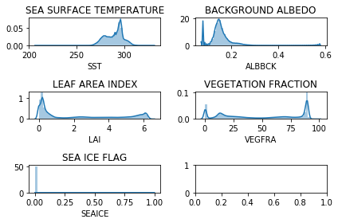
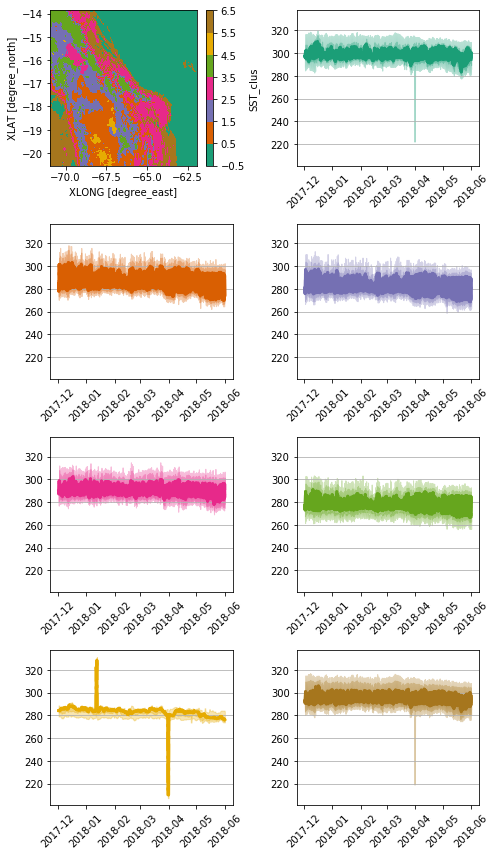
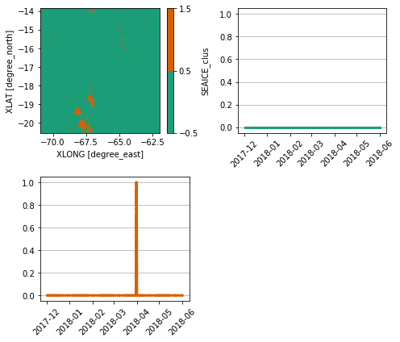
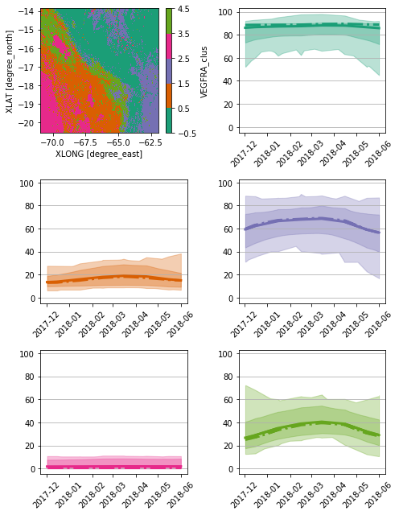
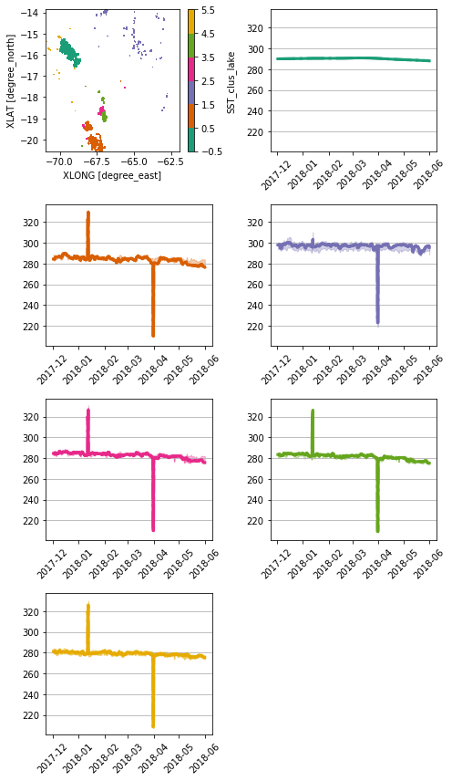
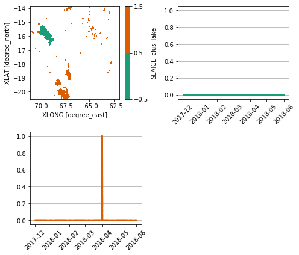

```python
%load_ext autoreload
```


```python
%autoreload 2
```


```python
from useful_scit.imps import *
import check_input_01_funs as pp
from check_input_01_funs import *
```


```python
# path = '/Volumes/mbProD/Downloads/wrf_small_files'
path = '/proj/atm/saltena/runs/run_2019_05_15/real/'
```


```python
glob.glob(path+'/wrf*')
```


    ['/proj/atm/saltena/runs/run_2019_05_15/real/wrflowinp_d04',
     '/proj/atm/saltena/runs/run_2019_05_15/real/wrfbdy_d01',
     '/proj/atm/saltena/runs/run_2019_05_15/real/wrfinput_d04',
     '/proj/atm/saltena/runs/run_2019_05_15/real/wrflowinp_d02',
     '/proj/atm/saltena/runs/run_2019_05_15/real/wrflowinp_d01',
     '/proj/atm/saltena/runs/run_2019_05_15/real/wrfinput_d02',
     '/proj/atm/saltena/runs/run_2019_05_15/real/wrflowinp_d03',
     '/proj/atm/saltena/runs/run_2019_05_15/real/wrffdda_d01',
     '/proj/atm/saltena/runs/run_2019_05_15/real/wrfinput_d01',
     '/proj/atm/saltena/runs/run_2019_05_15/real/wrfinput_d03']


```python
file_path = os.path.join(path,'wrflowinp_d03')
file_input = os.path.join(path,'wrfinput_d03')
```


```python
xa = xr.open_dataset(file_path)
```


```python
plot_lowinp_pars(xa)
```

    /homeappl/home/aliagadi/appl_taito/miniconda3/envs/b36/lib/python3.6/site-packages/scipy/stats/stats.py:1713: FutureWarning: Using a non-tuple sequence for multidimensional indexing is deprecated; use `arr[tuple(seq)]` instead of `arr[seq]`. In the future this will be interpreted as an array index, `arr[np.array(seq)]`, which will result either in an error or a different result.
      return np.add.reduce(sorted[indexer] * weights, axis=axis) / sumval





SST show issues:
- min<220 K 
- max>320 K


```python
xa_low = import_lowinp(file_path,file_input)
```


```python
p = 'SST'
p_c = p+'_clus'
nc = 7
cols = 2
plot_clus_sig(xa_low,p,p_c,nc,cols=2)
```





```python
p = 'SEAICE'
p_c = p+'_clus'
nc = 2
cols = 2
plot_clus_sig(xa_low,p,p_c,nc,cols=2)
```





```python
p = 'VEGFRA'
p_c = p+'_clus'
nc = 5
cols = 2
plot_clus_sig(xa_low,p,p_c,nc,cols=2)
```





```python
p = 'LAI'
p_c = p+'_clus'
nc = 6
cols = 2
plot_clus_sig(xa_low,p,p_c,nc,cols=2)
```


```python
x1 = xa_low.where(xa_low.LAKEMASK==1)
p = 'SST'
nc = 6
p_c = p+'_clus_lake'
cols = 2
plot_clus_sig(x1,p,p_c,nc,cols=2)
```





```python
x1 = xa_low.where(xa_low.LAKEMASK==1)
p = 'SEAICE'
nc = 2
p_c = p+'_clus_lake'
cols = 2
plot_clus_sig(x1,p,p_c,nc,cols=2)
```





```python

```


```python

```


```python

```


```python

```


```python

```


```python

```


```python

```


```python

```


```python


```


```python


```
