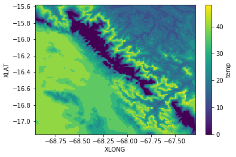
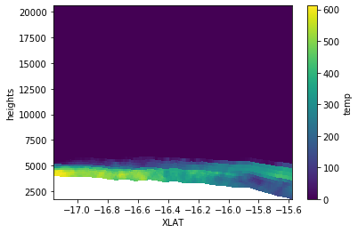
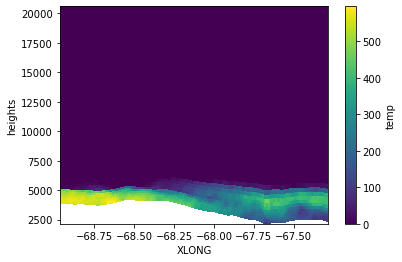
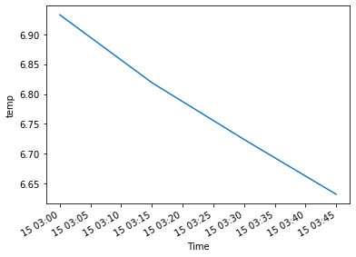

```python
from useful_scit.imps import *
import wrf 
from netCDF4 import Dataset
from sklearn.cluster import KMeans
```


```python
path = '/Volumes/mbProD/Downloads/wrf_out_sample/wrfout_d04*'
```


```python
files = glob.glob(path)
files.sort()
ncs = [Dataset(f) for f in files]
```


```python
tc = wrf.getvar(ncs,'tc',timeidx=wrf.ALL_TIMES, method="cat")
```


```python
z = wrf.getvar(ncs,'z',timeidx=wrf.ALL_TIMES, method="cat")
```


```python
tc['height']=z
```


```python
tc_t = tc1 = tc.to_series()
tc1 = tc1.unstack(level='Time')
```


```python
tc
```


    <xarray.DataArray 'temp' (Time: 4, bottom_top: 49, south_north: 150, west_east: 153)>
    array([[[[ 10.626526, ...,   3.558044],
             ...,
             [  7.74411 , ...,  25.969208]],
    
            ...,
    
            [[-68.81813 , ..., -70.88298 ],
             ...,
             [-70.01167 , ..., -71.67766 ]]],
    
    
           ...,
    
    
           [[[ 10.400543, ...,   3.794403],
             ...,
             [  8.282043, ...,  25.995697]],
    
            ...,
    
            [[-69.141266, ..., -70.50749 ],
             ...,
             [-70.02533 , ..., -71.36795 ]]]], dtype=float32)
    Coordinates:
        XLONG     (south_north, west_east) float32 -68.95856 -68.94759 ... -67.29216
        XLAT      (south_north, west_east) float32 -17.15197 -17.15197 ... -15.58474
        XTIME     (Time) float64 1.89e+04 1.892e+04 1.893e+04 1.894e+04
      * Time      (Time) datetime64[ns] 2017-12-15T03:00:00 ... 2017-12-15T03:45:00
        datetime  (Time) datetime64[ns] 2017-12-15T03:00:00 ... 2017-12-15T03:45:00
        height    (Time, bottom_top, south_north, west_east) float32 3899.392 ... 20357.758
    Dimensions without coordinates: bottom_top, south_north, west_east
    Attributes:
        FieldType:    104
        MemoryOrder:  XYZ
        description:  temperature
        units:        degC
        stagger:      
        coordinates:  XLONG XLAT XTIME
        projection:   Mercator(stand_lon=-66.30000305175781, moad_cen_lat=-17.000...


```python
kmeans = KMeans(n_clusters=6, random_state=0).fit(tc1)
```


```python
tc1['lab']=kmeans.labels_
```


```python
lab_da = tc1['lab'].to_xarray()
```


```python
labs = tc1['lab'].unique()
labs.sort()
labs
i = labs[5]
```


```python
labs
```


    array([0, 1, 2, 3, 4, 5])


```python
ti = tc.where(lab_da==i)
```


```python
ts = tc.to_dataset()
```


```python
ts['b_t']=ts.bottom_top
```


```python
tic=ti.count(dim=['Time','south_north','west_east'])
```


```python
(ts.b_t * tic).sum()/tic.sum()
```


    <xarray.Dataset>
    Dimensions:  ()
    Data variables:
        temp     float64 12.41


```python
plt.subplots()
ti.count(dim=['Time','bottom_top']).plot(x='XLONG',y='XLAT')
plt.subplots()
tii = ti.count(dim=['Time','west_east'])
tii = tii.assign_coords(heights=ti.height.mean(dim=['Time','west_east']))
tii = tii.assign_coords(XLAT=ti.XLAT.mean(dim=['west_east']))
tii.plot(x='XLAT',y='heights')
plt.subplots()
dimx = 'south_north'
tii = ti.count(dim=['Time',dimx])
tii = tii.assign_coords(heights=ti.height.mean(dim=['Time',dimx]))
tii = tii.assign_coords(XLONG=ti.XLONG.mean(dim=[dimx]))
tii.plot(x='XLONG',y='heights')
plt.subplots()
ti.median(dim=['bottom_top','south_north','west_east']).plot()
```


    [<matplotlib.lines.Line2D at 0x11e876b70>]














```python
sns.choose_colorbrewer_palette('s')
```


    [(0.9575547866205305, 0.9575547866205305, 0.9575547866205305),
     (0.9012072279892349, 0.9012072279892349, 0.9012072279892349),
     (0.8328950403690888, 0.8328950403690888, 0.8328950403690888),
     (0.7502191464821223, 0.7502191464821223, 0.7502191464821223),
     (0.6434140715109573, 0.6434140715109573, 0.6434140715109573),
     (0.5387158785082661, 0.5387158785082661, 0.5387158785082661),
     (0.440322952710496, 0.440322952710496, 0.440322952710496),
     (0.342883506343714, 0.342883506343714, 0.342883506343714),
     (0.22329873125720878, 0.22329873125720878, 0.22329873125720878),
     (0.10469819300269129, 0.10469819300269129, 0.10469819300269129)]


```python
tii
```


    <xarray.DataArray 'temp' (bottom_top: 49, west_east: 153)>
    array([[576, 576, 576, ..., 104, 108, 140],
           [576, 572, 572, ...,  96,  96, 124],
           [568, 568, 572, ...,  96,  88, 112],
           ...,
           [  0,   0,   0, ...,   0,   0,   0],
           [  0,   0,   0, ...,   0,   0,   0],
           [  0,   0,   0, ...,   0,   0,   0]])
    Coordinates:
      * bottom_top  (bottom_top) int64 0 1 2 3 4 5 6 7 8 ... 41 42 43 44 45 46 47 48
      * west_east   (west_east) int64 0 1 2 3 4 5 6 ... 146 147 148 149 150 151 152
        heights     (bottom_top, west_east) float32 3932.0017 3932.945 ... 20360.766
        XLONG       (west_east) float32 -68.95861 -68.94757 ... -67.30311 -67.29207


```python
ti.count(dim=['Time','west_east'])
```


    <xarray.DataArray 'temp' (bottom_top: 49, south_north: 150)>
    array([[612, 612, 612, ..., 160, 148, 136],
           [604, 604, 600, ..., 164, 148, 140],
           [600, 600, 600, ..., 168, 164, 144],
           ...,
           [  0,   0,   0, ...,   0,   0,   0],
           [  0,   0,   0, ...,   0,   0,   0],
           [  0,   0,   0, ...,   0,   0,   0]])
    Coordinates:
      * bottom_top   (bottom_top) int64 0 1 2 3 4 5 6 7 ... 41 42 43 44 45 46 47 48
      * south_north  (south_north) int64 0 1 2 3 4 5 6 ... 144 145 146 147 148 149


```python
ti.height.mean(dim=['Time','west_east'])
```


    <xarray.DataArray 'height' (bottom_top: 49, south_north: 150)>
    array([[ 4039.3726,  4032.9175,  4024.1013, ...,  1897.5559,  1850.9321,
             1799.6497],
           [ 4092.3525,  4085.9119,  4077.1208, ...,  1954.5134,  1907.9873,
             1856.8097],
           [ 4158.4136,  4151.993 ,  4143.2407, ...,  2026.484 ,  1980.1011,
             1929.0778],
           ...,
           [19506.846 , 19506.812 , 19506.764 , ..., 19498.732 , 19498.664 ,
            19498.592 ],
           [19938.027 , 19937.984 , 19937.922 , ..., 19929.744 , 19929.66  ,
            19929.568 ],
           [20373.297 , 20373.244 , 20373.166 , ..., 20364.035 , 20363.957 ,
            20363.86  ]], dtype=float32)
    Coordinates:
      * bottom_top   (bottom_top) int64 0 1 2 3 4 5 6 7 ... 41 42 43 44 45 46 47 48
      * south_north  (south_north) int64 0 1 2 3 4 5 6 ... 144 145 146 147 148 149


```python
r,c = tc1.shape
```


```python
print(r,c)
```


```python

```


```python
import rpy2
import rpy2.robjects as robjects
import rpy2.robjects.packages as rpackages
```


```python
rnc = rpackages.importr('NbClust')
```


```python
ii=10000
m = robjects.r.matrix(
    robjects.FloatVector(tc1[:ii*c].values.flatten()),
    nrow=ii*c
)
```


```python
res = rnc.NbClust(m,distance = "euclidean",
         method ='kmeans',**{'min.nc':2,'max.nc':3},
           index="silhouette")
```


```python
res
```


    ---------------------------------------------------------------------------

    NameError                                 Traceback (most recent call last)

    <ipython-input-1-c08785e04264> in <module>
    ----> 1 res
    

    NameError: name 'res' is not defined


```python
a
```


    2


```python
print(res)
```


    ---------------------------------------------------------------------------

    NameError                                 Traceback (most recent call last)

    <ipython-input-3-a90dea80f461> in <module>
    ----> 1 print(res)
    

    NameError: name 'res' is not defined


```python

```
