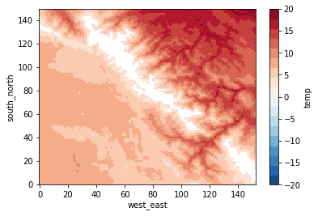
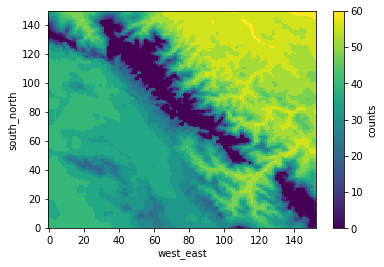
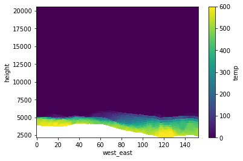
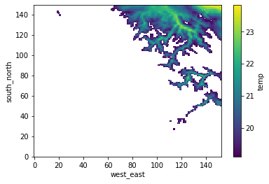
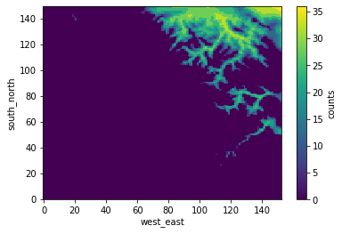
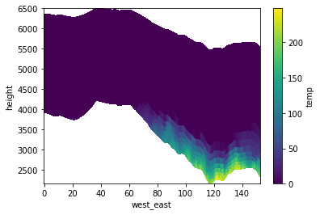

```python
from useful_scit.imps import *
import wrf 
from netCDF4 import Dataset
from sklearn.cluster import KMeans
from out_put_check_funs import *
```


```python
path = '/Volumes/mbProD/Downloads/wrf_out_sample/wrfout_d04*'
clus_num = 6 
var = 'tc'
var_name = 'temp'
```


```python
ds = cluster_ds(path,clus_num,var,var_name)
```


```python
i=0
plt.subplots()
dsi = ds.temp.where(ds.new_lab==i)
dsi.mean(dim=['Time','bottom_top']).plot(cmap = cmBuRd,
                                        vmin=-20,vmax=20)
plt.subplots()
dsc = dsi.count(dim=['Time','bottom_top'])
dsc.name = 'counts'
dsc.plot()
plt.subplots()
dsi = ds[['temp']].where(ds.new_lab==i)
dsi = dsi.count(dim=['Time','south_north'])
dsi = dsi.assign_coords(height=ds.height.mean(dim=['Time','south_north']))

dsi.temp.plot(x='west_east',y='height')
```

    /Users/diego/miniconda3/envs/b36/lib/python3.6/site-packages/xarray/core/nanops.py:159: RuntimeWarning: Mean of empty slice
      return np.nanmean(a, axis=axis, dtype=dtype)


    <matplotlib.collections.QuadMesh at 0x14d7fb208>











```python
ds1 = ds.where(ds.new_lab==0,drop=True)
```


```python
ds2 = cluster_ds_raw(ds1,6,var, var_name)['ds']
```


```python
i=5
plt.subplots()
dsi = ds2.temp.where(ds2.clus_lab==i)
dsi.mean(dim=['Time','bottom_top']).plot()
plt.subplots()
dsc = dsi.count(dim=['Time','bottom_top'])
dsc.name = 'counts'
dsc.plot()
plt.subplots()
dsi = ds2[['temp']].where(ds2.clus_lab==i)
dsi = dsi.count(dim=['Time','south_north'])
dsi = dsi.assign_coords(height=ds.height.mean(dim=['Time','south_north']))

dsi.temp.plot(x='west_east',y='height')
```

    /Users/diego/miniconda3/envs/b36/lib/python3.6/site-packages/xarray/core/nanops.py:159: RuntimeWarning: Mean of empty slice
      return np.nanmean(a, axis=axis, dtype=dtype)


    <matplotlib.collections.QuadMesh at 0x14ccfd6d8>











```python
matplotlib.colors.ListedColormap(sns.color_palette('Greys',18))
```


    <matplotlib.colors.ListedColormap at 0x13d7dfd30>


```python
sns.choose_colorbrewer_palette('s')
```


    interactive(children=(Dropdown(description='name', options=('Greys', 'Reds', 'Greens', 'Blues', 'Oranges', 'Pu…


    [(0.9575547866205305, 0.9575547866205305, 0.9575547866205305),
     (0.9012072279892349, 0.9012072279892349, 0.9012072279892349),
     (0.8328950403690888, 0.8328950403690888, 0.8328950403690888),
     (0.7502191464821223, 0.7502191464821223, 0.7502191464821223),
     (0.6434140715109573, 0.6434140715109573, 0.6434140715109573),
     (0.5387158785082661, 0.5387158785082661, 0.5387158785082661),
     (0.440322952710496, 0.440322952710496, 0.440322952710496),
     (0.342883506343714, 0.342883506343714, 0.342883506343714),
     (0.22329873125720878, 0.22329873125720878, 0.22329873125720878),
     (0.10469819300269129, 0.10469819300269129, 0.10469819300269129)]


```python

```


    [(0.9760092272202999, 0.9760092272202999, 0.9760092272202999),
     (0.9520184544405997, 0.9520184544405997, 0.9520184544405997),
     (0.9181853133410227, 0.9181853133410227, 0.9181853133410227),
     (0.8813994617454826, 0.8813994617454826, 0.8813994617454826),
     (0.8397846981930027, 0.8397846981930027, 0.8397846981930027),
     (0.7950019223375625, 0.7950019223375625, 0.7950019223375625),
     (0.7467743175701653, 0.7467743175701653, 0.7467743175701653),
     (0.6865974625144176, 0.6865974625144176, 0.6865974625144176),
     (0.6194232987312572, 0.6194232987312572, 0.6194232987312572),
     (0.560246059207997, 0.560246059207997, 0.560246059207997),
     (0.4999615532487506, 0.4999615532487506, 0.4999615532487506),
     (0.44438292964244525, 0.44438292964244525, 0.44438292964244525),
     (0.3875432525951557, 0.3875432525951557, 0.3875432525951557),
     (0.3347635524798155, 0.3347635524798155, 0.3347635524798155),
     (0.26205305651672434, 0.26205305651672434, 0.26205305651672434),
     (0.190080738177624, 0.190080738177624, 0.190080738177624),
     (0.11835447904652058, 0.11835447904652058, 0.11835447904652058),
     (0.05917723952326029, 0.05917723952326029, 0.05917723952326029)]


```python

```
