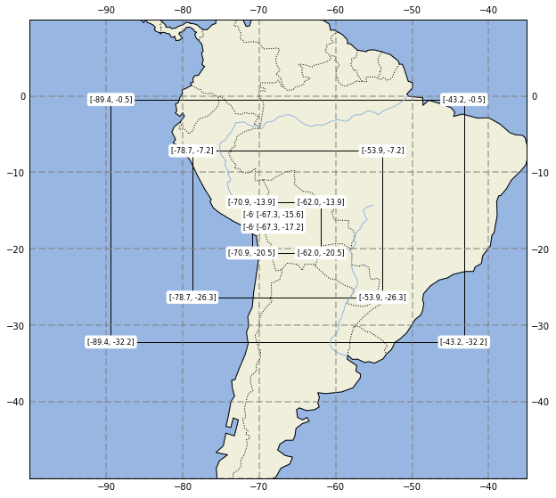
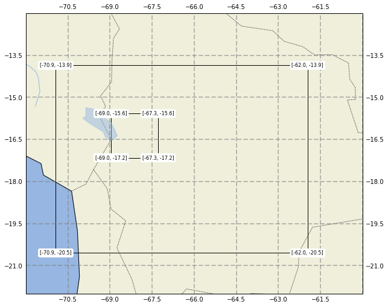

```python
from useful_scit.imps import *
from out_grid_funs import *
from matplotlib.patches import Polygon
```


```python
path = '/Users/diego/Downloads/wrf_out_sample/'
```


```python
files = os.path.join(path,'wrf*')
files = glob.glob(files)
files
```


    []


```python
files_dic = get_files(path)
```


```python
files_dic['ll']=files_dic.apply(lambda r: get_ll(r.path), axis=1 )
```


```python

```


```python
ax,proj = get_map(-100,-35,-50,10,pargs={'figsize':(10,10)})
for l,r in files_dic.iterrows():
    ll = r.ll
    plot_pol(r.ll,ax)
    add_text_ll(ll,ax)
ax.set_xlim(-100,-35)
ax.set_ylim(-50,10);
```





```python
ax,proj = get_map(-100,-35,-50,10,pargs={'figsize':(10,10)})
for l,r in files_dic[-2:].iterrows():
    ll = r.ll
    plot_pol(r.ll,ax)
    add_text_ll(ll,ax)
ax.set_xlim(-72,-60)
ax.set_ylim(-22,-12);
```





```python
for r,v in files_dic.iterrows():
    print(pd.DataFrame(v['ll'],[r]).T.round(7))
```

                d1
    loM -43.211700
    lom -89.388306
    laM  -0.481514
    lam -32.188271
                d2
    loM -53.867840
    lom -78.732163
    laM  -7.172142
    lam -26.339253
                d3
    loM -61.958614
    lom -70.937401
    laM -13.861786
    lam -20.549194
                d4
    loM -67.286682
    lom -68.964035
    laM -15.579453
    lam -17.157211


```python
file = files[0]
```


```python
xa = xr.open_dataset(file)
```


```python
df = xa.XLONG_U[0,0].to_pandas()
```


```python
def fun(x):
    global xx
    xx=x
    return x[-1] - x[0]
res = df.rolling(2).apply(lambda x: fun(x), raw=True)
```


```python
res.value_counts()
```


    0.394669    49
    0.394672    36
    0.394676    32
    dtype: int64


```python
xx[0]
```


    5e-324


```python

```
