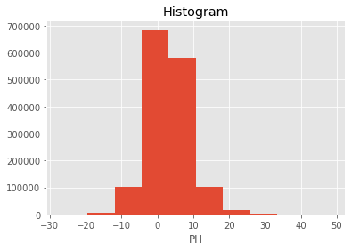

# imports


```python
from useful_scit.imps import (
    pd,np,xr,za,mpl,plt,sns, pjoin, 
    os,glob,dt,sys,ucp,log, splot, crt,axsplot)
import re
import wrf_management.modules.util as wutil
```

    The autoreload extension is already loaded. To reload it, use:
      %reload_ext autoreload


# code 


```python
flx_path = '/homeappl/home/aliagadi/appl_taito/' +\
'FLEXPART-WRF_v3.3.2/readwind_nests.f90'
```


```python
with open(flx_path, 'r') as op:
    txt = op.read()
```


```python
_vars = re.findall(r'\ *?[^!\n]*?varname\ *=\ *\'(.+)\'',txt)
```


```python
var = 'var'
df_v = pd.DataFrame(_vars,columns=[var])
df_v = df_v.sort_values(var).reset_index(drop=True)
```


```python
df_v = df_v.drop_duplicates().copy()
```

## WRF files


```python
wrf_path = \
'/proj/atm/saltena/runs/run_2019_05_15/' +\
'wrf/wrfout_d0*2018-03-08_*'
```


```python
wrf_path = '/proj/atm/saltena/runs/run_2019_05_15/wrf/'
```


```python
wrf_files = wutil.get_df_list(path=wrf_path)
```


```python
_i = 1
_s = slice('2018-03-08 14','2018-03-08 16')
_wr = wrf_files.loc[(_s,_i),:]
```


```python
p = _wr.iloc[0]['p']
_ds = xr.open_dataset(p)
```


```python
var = 'var'

def _find_exists(r,ds):
    va = r['var']
    ret = False
    try: ds[va];ret=True
    except: pass
    return ret

def _find_dims(r,ds):
    va = r['var']
    ret = 0
    try: ret = len(ds[va].dims)
    except: pass
    return ret

def _find_time_dim(r,ds):
    va = r['var']
    ret = False
    try: ret = ('Time' in ds[va].dims)
    except: pass
    return ret
def _find_other_dim(r,ds):
    va = r['var']
    ret = False
    try: ret = list(set(list(ds[va].dims))-set(('Time',)))
    except: pass
    return ret

def _find_desc(r,ds):
    va = r['var']
    ret = False
    try: ret = ds[va].description
    except: pass
    return ret
```


```python
exists = 'exists'
ndims = 'ndims'
tdim = 't_dim'
dims = 'dims'
desc = 'desc'

df_v[exists]=df_v.apply(lambda r: _find_exists(r,_ds),axis=1)
df_v[ndims]=df_v.apply(lambda r: _find_dims(r,_ds),axis=1)
df_v[tdim]=df_v.apply(lambda r: _find_time_dim(r,_ds),axis=1)
df_v[dims]=df_v.apply(lambda r: _find_other_dim(r,_ds),axis=1)
df_v[desc]=df_v.apply(lambda r: _find_desc(r,_ds),axis=1)
```


```python
df_v1 = df_v[df_v[exists]]
```


```python
df_v1
```


<div>
<style scoped>
    .dataframe tbody tr th:only-of-type {
        vertical-align: middle;
    }

    .dataframe tbody tr th {
        vertical-align: top;
    }

    .dataframe thead th {
        text-align: right;
    }
</style>
<table border="1" class="dataframe">
  <thead>
    <tr style="text-align: right;">
      <th></th>
      <th>var</th>
      <th>exists</th>
      <th>dims</th>
      <th>t_dim</th>
      <th>ndims</th>
      <th>desc</th>
    </tr>
  </thead>
  <tbody>
    <tr>
      <td>3</td>
      <td>CLDFRA</td>
      <td>True</td>
      <td>{south_north, west_east, bottom_top}</td>
      <td>True</td>
      <td>4</td>
      <td>CLOUD FRACTION</td>
    </tr>
    <tr>
      <td>4</td>
      <td>HFX</td>
      <td>True</td>
      <td>{south_north, west_east}</td>
      <td>True</td>
      <td>3</td>
      <td>UPWARD HEAT FLUX AT THE SURFACE</td>
    </tr>
    <tr>
      <td>5</td>
      <td>LU_INDEX</td>
      <td>True</td>
      <td>{south_north, west_east}</td>
      <td>True</td>
      <td>3</td>
      <td>LAND USE CATEGORY</td>
    </tr>
    <tr>
      <td>6</td>
      <td>MAPFAC_M</td>
      <td>True</td>
      <td>{south_north, west_east}</td>
      <td>True</td>
      <td>3</td>
      <td>Map scale factor on mass grid</td>
    </tr>
    <tr>
      <td>7</td>
      <td>MAPFAC_MX</td>
      <td>True</td>
      <td>{south_north, west_east}</td>
      <td>True</td>
      <td>3</td>
      <td>Map scale factor on mass grid, x direction</td>
    </tr>
    <tr>
      <td>8</td>
      <td>MAPFAC_MY</td>
      <td>True</td>
      <td>{south_north, west_east}</td>
      <td>True</td>
      <td>3</td>
      <td>Map scale factor on mass grid, y direction</td>
    </tr>
    <tr>
      <td>9</td>
      <td>MAPFAC_U</td>
      <td>True</td>
      <td>{south_north, west_east_stag}</td>
      <td>True</td>
      <td>3</td>
      <td>Map scale factor on u-grid</td>
    </tr>
    <tr>
      <td>11</td>
      <td>MAPFAC_V</td>
      <td>True</td>
      <td>{west_east, south_north_stag}</td>
      <td>True</td>
      <td>3</td>
      <td>Map scale factor on v-grid</td>
    </tr>
    <tr>
      <td>14</td>
      <td>MUB</td>
      <td>True</td>
      <td>{south_north, west_east}</td>
      <td>True</td>
      <td>3</td>
      <td>base state dry air mass in column</td>
    </tr>
    <tr>
      <td>15</td>
      <td>P</td>
      <td>True</td>
      <td>{south_north, west_east, bottom_top}</td>
      <td>True</td>
      <td>4</td>
      <td>perturbation pressure</td>
    </tr>
    <tr>
      <td>16</td>
      <td>PB</td>
      <td>True</td>
      <td>{south_north, west_east, bottom_top}</td>
      <td>True</td>
      <td>4</td>
      <td>BASE STATE PRESSURE</td>
    </tr>
    <tr>
      <td>17</td>
      <td>PBLH</td>
      <td>True</td>
      <td>{south_north, west_east}</td>
      <td>True</td>
      <td>3</td>
      <td>PBL HEIGHT</td>
    </tr>
    <tr>
      <td>18</td>
      <td>PH</td>
      <td>True</td>
      <td>{south_north, west_east, bottom_top_stag}</td>
      <td>True</td>
      <td>4</td>
      <td>perturbation geopotential</td>
    </tr>
    <tr>
      <td>19</td>
      <td>PHB</td>
      <td>True</td>
      <td>{south_north, west_east, bottom_top_stag}</td>
      <td>True</td>
      <td>4</td>
      <td>base-state geopotential</td>
    </tr>
    <tr>
      <td>20</td>
      <td>PSFC</td>
      <td>True</td>
      <td>{south_north, west_east}</td>
      <td>True</td>
      <td>3</td>
      <td>SFC PRESSURE</td>
    </tr>
    <tr>
      <td>21</td>
      <td>P_TOP</td>
      <td>True</td>
      <td>{}</td>
      <td>True</td>
      <td>1</td>
      <td>PRESSURE TOP OF THE MODEL</td>
    </tr>
    <tr>
      <td>22</td>
      <td>Q2</td>
      <td>True</td>
      <td>{south_north, west_east}</td>
      <td>True</td>
      <td>3</td>
      <td>QV at 2 M</td>
    </tr>
    <tr>
      <td>23</td>
      <td>QVAPOR</td>
      <td>True</td>
      <td>{south_north, west_east, bottom_top}</td>
      <td>True</td>
      <td>4</td>
      <td>Water vapor mixing ratio</td>
    </tr>
    <tr>
      <td>24</td>
      <td>RAINC</td>
      <td>True</td>
      <td>{south_north, west_east}</td>
      <td>True</td>
      <td>3</td>
      <td>ACCUMULATED TOTAL CUMULUS PRECIPITATION</td>
    </tr>
    <tr>
      <td>25</td>
      <td>RAINNC</td>
      <td>True</td>
      <td>{south_north, west_east}</td>
      <td>True</td>
      <td>3</td>
      <td>ACCUMULATED TOTAL GRID SCALE PRECIPITATION</td>
    </tr>
    <tr>
      <td>26</td>
      <td>SNOWH</td>
      <td>True</td>
      <td>{south_north, west_east}</td>
      <td>True</td>
      <td>3</td>
      <td>PHYSICAL SNOW DEPTH</td>
    </tr>
    <tr>
      <td>27</td>
      <td>SWDOWN</td>
      <td>True</td>
      <td>{south_north, west_east}</td>
      <td>True</td>
      <td>3</td>
      <td>DOWNWARD SHORT WAVE FLUX AT GROUND SURFACE</td>
    </tr>
    <tr>
      <td>28</td>
      <td>T</td>
      <td>True</td>
      <td>{south_north, west_east, bottom_top}</td>
      <td>True</td>
      <td>4</td>
      <td>perturbation potential temperature theta-t0</td>
    </tr>
    <tr>
      <td>29</td>
      <td>T2</td>
      <td>True</td>
      <td>{south_north, west_east}</td>
      <td>True</td>
      <td>3</td>
      <td>TEMP at 2 M</td>
    </tr>
    <tr>
      <td>31</td>
      <td>TKE_PBL</td>
      <td>True</td>
      <td>{south_north, west_east, bottom_top_stag}</td>
      <td>True</td>
      <td>4</td>
      <td>TKE from PBL</td>
    </tr>
    <tr>
      <td>32</td>
      <td>U</td>
      <td>True</td>
      <td>{south_north, west_east_stag, bottom_top}</td>
      <td>True</td>
      <td>4</td>
      <td>x-wind component</td>
    </tr>
    <tr>
      <td>34</td>
      <td>U10</td>
      <td>True</td>
      <td>{south_north, west_east}</td>
      <td>True</td>
      <td>3</td>
      <td>U at 10 M</td>
    </tr>
    <tr>
      <td>35</td>
      <td>UST</td>
      <td>True</td>
      <td>{south_north, west_east}</td>
      <td>True</td>
      <td>3</td>
      <td>U* IN SIMILARITY THEORY</td>
    </tr>
    <tr>
      <td>36</td>
      <td>V</td>
      <td>True</td>
      <td>{west_east, bottom_top, south_north_stag}</td>
      <td>True</td>
      <td>4</td>
      <td>y-wind component</td>
    </tr>
    <tr>
      <td>38</td>
      <td>V10</td>
      <td>True</td>
      <td>{south_north, west_east}</td>
      <td>True</td>
      <td>3</td>
      <td>V at 10 M</td>
    </tr>
    <tr>
      <td>39</td>
      <td>W</td>
      <td>True</td>
      <td>{south_north, west_east, bottom_top_stag}</td>
      <td>True</td>
      <td>4</td>
      <td>z-wind component</td>
    </tr>
    <tr>
      <td>42</td>
      <td>XLAT</td>
      <td>True</td>
      <td>{south_north, west_east}</td>
      <td>True</td>
      <td>3</td>
      <td>LATITUDE, SOUTH IS NEGATIVE</td>
    </tr>
    <tr>
      <td>43</td>
      <td>XLONG</td>
      <td>True</td>
      <td>{south_north, west_east}</td>
      <td>True</td>
      <td>3</td>
      <td>LONGITUDE, WEST IS NEGATIVE</td>
    </tr>
    <tr>
      <td>44</td>
      <td>ZNU</td>
      <td>True</td>
      <td>{bottom_top}</td>
      <td>True</td>
      <td>2</td>
      <td>eta values on half (mass) levels</td>
    </tr>
    <tr>
      <td>45</td>
      <td>ZNW</td>
      <td>True</td>
      <td>{bottom_top_stag}</td>
      <td>True</td>
      <td>2</td>
      <td>eta values on full (w) levels</td>
    </tr>
  </tbody>
</table>
</div>


```python
_id = 1
_s = slice('2018-03-08 14','2018-03-08 15')
_wr = wrf_files.loc[(_s,_id),:]

XTIME = 'XTIME'
Time = 'Time'
wds = xr.open_mfdataset(_wr['p'],concat_dim=Time,combine='nested')
wds = wds.swap_dims({Time:XTIME})
```


```python

df_v1
row = df_v1.iloc[12]
va = row[var]
_wd = wds[va]
_wds = _wd.shift(**{XTIME:-1})
va
```


    'PH'


```python
_der = _wds-_wd
_derAll = _der.loc[{XTIME:slice('2018-03-08 14:00','2018-03-08 14:30')}]
_derRes = _der.loc[{XTIME:slice('2018-03-08 14:45','2018-03-08 14:45')}]
```


```python
derResult = _derRes.mean(XTIME)/(_derAll.mean(XTIME).where(
    np.abs(_derAll)>1e-1,1
))
```


```python
ax = axsplot()
_res = pd.Series(derResult.values.flatten()).dropna().values
description = pd.DataFrame(_res,columns=[va]).describe()
sns.distplot(_res,kde=False,ax=ax, label = va);
ax.legend()
ax.set_title(f'dom:{_id}-{row[desc]}')
ax.table(
    cellText=description.values,
    rowLabels=description.index.values,
    colLabels=[va],
    cellLoc='left',
    bbox=[1.2,0,.5,1]
        )
```


```python
(_derAll.mean(XTIME).where(_derAll!=0,1)).max().values
```


    array(48.512695, dtype=float32)


```python
_derAll.mean(XTIME).where(~(_derAll==0),1).plot()
```


    (array([7.95000e+02, 4.57500e+03, 1.00199e+05, 6.84103e+05, 5.81757e+05,
            1.02765e+05, 1.62210e+04, 1.13100e+03, 1.65000e+02, 3.90000e+01]),
     array([-27.085938 , -19.526073 , -11.966211 ,  -4.4063478,   3.1535156,
             10.713379 ,  18.273243 ,  25.833105 ,  33.392967 ,  40.95283  ,
             48.512695 ], dtype=float32),
     <a list of 10 Patch objects>)





```python
rr=((_derAll.mean(XTIME).where(_derAll!=0,1)).values==0).flatten().astype(int)
```


```python
pd.Series(rr).value_counts()
```


    0    1491732
    1         18
    dtype: int64


```python
wds['UST'][{}]
```


    <xarray.DataArray 'UST' (Time: 8, south_north: 85, west_east: 117)>
    dask.array<shape=(8, 85, 117), dtype=float32, chunksize=(4, 85, 117)>
    Coordinates:
        XLAT     (Time, south_north, west_east) float32 dask.array<shape=(8, 85, 117), chunksize=(4, 85, 117)>
        XLONG    (Time, south_north, west_east) float32 dask.array<shape=(8, 85, 117), chunksize=(4, 85, 117)>
        XTIME    (Time) datetime64[ns] dask.array<shape=(8,), chunksize=(4,)>
    Dimensions without coordinates: Time, south_north, west_east
    Attributes:
        FieldType:    104
        MemoryOrder:  XY 
        description:  U* IN SIMILARITY THEORY
        units:        m s-1
        stagger:      


```python
ucp.set_dpi(300)
```


```python
for i in range(1,5):
    _id = i
    _s = slice('2018-03-08 14','2018-03-08 15')
    _wr = wrf_files.loc[(_s,_id),:]

    XTIME = 'XTIME'
    Time = 'Time'
    wds = xr.open_mfdataset(_wr['p'],concat_dim=Time,combine='nested')
    wds = wds.swap_dims({Time:XTIME})
    u1 = wds.loc[{XTIME:'2018-03-08 14:45'}]['UST']
    u2 = wds.loc[{XTIME:'2018-03-08 15:00'}]['UST']
    axs = axsplot(1,3,figsize=(11,3)).flatten()
    u1.plot(ax=axs[0]);
    u2.plot(ax=axs[1]);
    ((u2-u1)).plot(ax=axs[2]);
    axs[2].set_title(f'dom:{i} '+'$\\frac{u^*_2-u^*_1}{1}$');
    axs[2].figure.tight_layout()
    
```


```python
!jupyter-nbconvert --to markdown check_restart_issues.ipynb
```


```python

```
