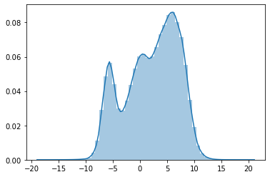
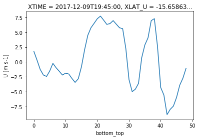
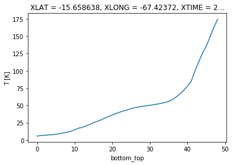
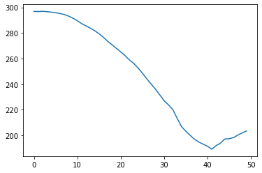
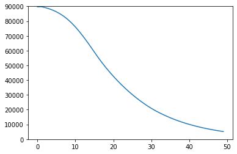
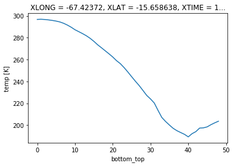
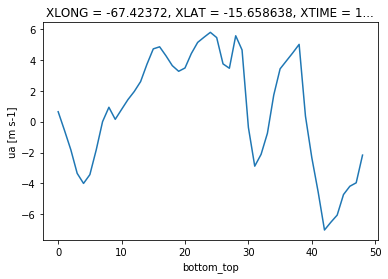
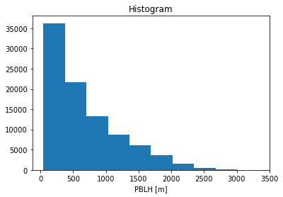

```python
from useful_scit.imps import *
```


```python
path = '/Volumes/mbProD/Downloads/rich_rwf/wrfout_d04_2017-12-09_19:00:00'
```


```python
ds = xr.open_dataset(path)
```


```python
sns.distplot(ds.U.values.flatten())
```


    <matplotlib.axes._subplots.AxesSubplot at 0x118fadef0>





```python
ds.U.isel(Time=3, west_east_stag=140,south_north=142).plot()
```


    [<matplotlib.lines.Line2D at 0x1196a8c88>]





```python
ds.T.where(ds.T.round(2)==round((296.85269165-290.),2)).to_series().dropna()
```


    Time  bottom_top  south_north  west_east
    1     1           142          140          6.851624
    2     0           141          138          6.846924
          1           142          139          6.853027
                      144          138          6.847321
    Name: T, dtype: float32


```python
(ds.T.isel(Time=0,west_east=140,south_north=142)).plot()
```


    [<matplotlib.lines.Line2D at 0x124fbf940>]





```python
tt = [
  2.9685269165E+02,  2.9677893066E+02,  2.9694500732E+02,  2.9670242310E+02,
  2.9633966064E+02,  2.9585580444E+02,  2.9525155640E+02,  2.9445236206E+02,
  2.9320932007E+02,  2.9156552124E+02,  2.8960998535E+02,  2.8731533813E+02,
  2.8555630493E+02,  2.8376669312E+02,  2.8181393433E+02,  2.7947006226E+02,
  2.7667947388E+02,  2.7352664185E+02,  2.7081872559E+02,  2.6802398682E+02,
  2.6524786377E+02,  2.6233285522E+02,  2.5896276855E+02,  2.5624670410E+02,
  2.5263270569E+02,  2.4857107544E+02,  2.4429113770E+02,  2.4009616089E+02,
  2.3613082886E+02,  2.3166197205E+02,  2.2710699463E+02,  2.2387869263E+02,
  2.2014776611E+02,  2.1334902954E+02,  2.0691580200E+02,  2.0321623230E+02,
  1.9999977112E+02,  1.9697372437E+02,  1.9478965759E+02,  1.9309629822E+02,
  1.9145060730E+02,  1.8914906311E+02,  1.9203544617E+02,  1.9389584351E+02,
  1.9714886475E+02,  1.9736492920E+02,  1.9824922180E+02,  2.0023616028E+02,
  2.0192065430E+02,  2.0342620850E+02,
]
plt.plot(tt)
```


    [<matplotlib.lines.Line2D at 0x11c2a1080>]





```python
pp = [
  8.9664539062E+04,  8.9756578125E+04,  8.9159242188E+04,  8.8402781250E+04,
  8.7462914062E+04,  8.6294953125E+04,  8.4868195312E+04,  8.3146914062E+04,
  8.1108414062E+04,  7.8738031250E+04,  7.6041445312E+04,  7.3045132812E+04,
  6.9792257812E+04,  6.6338148438E+04,  6.2738914062E+04,  5.9022742188E+04,
  5.5358738281E+04,  5.1906929688E+04,  4.8648578125E+04,  4.5567558594E+04,
  4.2652714844E+04,  3.9893667969E+04,  3.7281976562E+04,  3.4805468750E+04,
  3.2460773438E+04,  3.0240398438E+04,  2.8138074219E+04,  2.6157736328E+04,
  2.4301029297E+04,  2.2562312500E+04,  2.0939951172E+04,  1.9452503906E+04,
  1.8099107422E+04,  1.6840470703E+04,  1.5651799805E+04,  1.4538021484E+04,
  1.3501234375E+04,  1.2538455078E+04,  1.1647401367E+04,  1.0822774414E+04,
  1.0056514648E+04,  9.3434257812E+03,  8.6812402344E+03,  8.0667509766E+03,
  7.4954741211E+03,  6.9642075195E+03,  6.4706459961E+03,  6.0124985352E+03,
  5.5866577148E+03,  5.1905786133E+03,
]
ax=plt.plot(tt)
plt.gca().set_ylim(0,90000)
```


    (0, 90000)





```python
import wrf
```


```python
from netCDF4 import Dataset
from wrf import getvar

ncfile = Dataset(path)
```


```python
wrf.getvar(ncfile,'tk',timeidx=1).isel(west_east=140,south_north=142).plot()
```


    [<matplotlib.lines.Line2D at 0x12344e358>]





```python
wrf.getvar(ncfile,'ua',timeidx=1).isel(west_east=140,south_north=142).plot()
```


    [<matplotlib.lines.Line2D at 0x12339b630>]





```python
ds.CLDFRA
```


    <xarray.DataArray 'CLDFRA' (Time: 4, bottom_top: 49, south_north: 150, west_east: 153)>
    [4498200 values with dtype=float32]
    Coordinates:
        XLAT     (Time, south_north, west_east) float32 ...
        XLONG    (Time, south_north, west_east) float32 ...
        XTIME    (Time) datetime64[ns] ...
    Dimensions without coordinates: Time, bottom_top, south_north, west_east
    Attributes:
        FieldType:    104
        MemoryOrder:  XYZ
        description:  CLOUD FRACTION
        units:        
        stagger:      


```python
ds.PBLH.plot()
```


    (array([3.6238e+04, 2.1620e+04, 1.3244e+04, 8.7090e+03, 6.0210e+03,
            3.7010e+03, 1.6270e+03, 5.0800e+02, 1.0500e+02, 2.7000e+01]),
     array([  43.45215,  372.81064,  702.1691 , 1031.5276 , 1360.8861 ,
            1690.2446 , 2019.6031 , 2348.9617 , 2678.32   , 3007.6787 ,
            3337.037  ], dtype=float32),
     <a list of 10 Patch objects>)





```python

```
