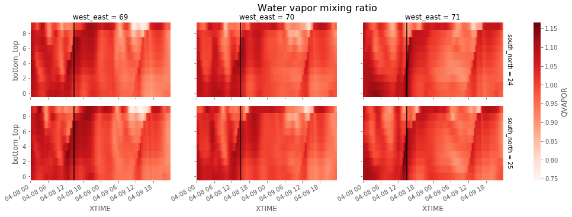

```python
from useful_scit.imps import *
import pprint
import funs
```


```python

```


```python

```


```python
class Dummy:
    def __init__(self):
        pass
path = '/proj/atm/saltena/runs/run_2019_05_15/wrf'
df = funs.get_files_df(path)
```


```python
_df = df[(df[funs.DOM]==1)&(df[funs.KIND]==funs.wrfrst)]
_df['2018-04-08':'2018-04-09']
```


<div>
<style scoped>
    .dataframe tbody tr th:only-of-type {
        vertical-align: middle;
    }

    .dataframe tbody tr th {
        vertical-align: top;
    }

    .dataframe thead th {
        text-align: right;
    }
</style>
<table border="1" class="dataframe">
  <thead>
    <tr style="text-align: right;">
      <th></th>
      <th>PATH</th>
      <th>NAME</th>
      <th>DOM</th>
      <th>KIND</th>
      <th>MONTH</th>
    </tr>
    <tr>
      <th>DATE</th>
      <th></th>
      <th></th>
      <th></th>
      <th></th>
      <th></th>
    </tr>
  </thead>
  <tbody>
    <tr>
      <td>2018-04-08 03:00:00</td>
      <td>/proj/atm/saltena/runs/run_2019_05_15/wrf/wrfr...</td>
      <td>wrfrst_d01_2018-04-08_03:00:00</td>
      <td>1</td>
      <td>wrfrst</td>
      <td>4</td>
    </tr>
    <tr>
      <td>2018-04-08 15:00:00</td>
      <td>/proj/atm/saltena/runs/run_2019_05_15/wrf/wrfr...</td>
      <td>wrfrst_d01_2018-04-08_15:00:00</td>
      <td>1</td>
      <td>wrfrst</td>
      <td>4</td>
    </tr>
    <tr>
      <td>2018-04-09 03:00:00</td>
      <td>/proj/atm/saltena/runs/run_2019_05_15/wrf/wrfr...</td>
      <td>wrfrst_d01_2018-04-09_03:00:00</td>
      <td>1</td>
      <td>wrfrst</td>
      <td>4</td>
    </tr>
    <tr>
      <td>2018-04-09 15:00:00</td>
      <td>/proj/atm/saltena/runs/run_2019_05_15/wrf/wrfr...</td>
      <td>wrfrst_d01_2018-04-09_15:00:00</td>
      <td>1</td>
      <td>wrfrst</td>
      <td>4</td>
    </tr>
  </tbody>
</table>
</div>


```python
_df = df[(df[funs.DOM]==1)&(df[funs.KIND]==funs.wrfout)]
_df = _df['2018-04-08':'2018-04-09']
_paths = _df[funs.PATH].values
```


```python
ds = xr.open_mfdataset(_paths)
```

    /homeappl/home/aliagadi/appl_taito/miniconda3/envs/b36backup/lib/python3.6/site-packages/xarray/backends/api.py:783: FutureWarning: In xarray version 0.13 `auto_combine` will be deprecated.
      coords=coords)
    /homeappl/home/aliagadi/appl_taito/miniconda3/envs/b36backup/lib/python3.6/site-packages/xarray/backends/api.py:783: FutureWarning: The datasets supplied do not have global dimension coordinates. In
    future, to continue concatenating without supplying dimension
    coordinates, please use the new `combine_nested` function (or the
    `combine='nested'` option to open_mfdataset.
      coords=coords)


```python
XLAT = 'XLAT'
XLONG = 'XLONG'
try:
    ds[XLAT]= ds[XLAT].mean(TIME)
    ds[XLONG]= ds[XLONG].mean(TIME)
except: pass
```


```python
# ds
```


```python
_boo = \
    (ds[XLAT] < -23) &(ds[XLAT] > -24)  & \
    (ds[XLONG]< -61) &(ds[XLONG]> -62)  

```


```python
_va = funs.U10

for _va in funs.VARS2D[:]:
#     print(_va)
    _da = ds[_va].where(_boo)
    if funs.TIME in _da.dims:
        _da1=_da.dropna(south_north,how='all').dropna(west_east,how='all')

        _da2 = _da1.swap_dims({funs.TIME:funs.XTIME})

        _fg = _da2.plot.line(col=west_east,row=south_north,figsize=[15,5])
        axs=_fg.axes.flatten()
        for ax in axs:
            ax.axvline(pd.Timestamp('2018-04-08 15'),color='k');
        ax.figure.suptitle(_da2.description,y=1.01,fontsize=16)
        ax.figure.tight_layout()
```


```python
funs.VARS3D
```


    ['PB', 'P', 'PHB', 'PH', 'T', 'QVAPOR', 'TKE']


```python
bottom_top = 'bottom_top'
bottom_top_stag = 'bottom_top_stag'
cm = plt.get_cmap('Reds')
for _va in funs.VARS3D[:]:
#     print(_va)
    _da = ds[_va].where(_boo)
    if funs.TIME in _da.dims:
        _da1=_da.dropna(south_north,how='all').dropna(west_east,how='all').load()
        try:_da1 = _da1.isel(**{bottom_top:slice(0,10)})
        except: _da1 = _da1.isel(**{bottom_top_stag:slice(0,10)})

        _da2 = _da1.swap_dims({funs.TIME:funs.XTIME})
        
        _das = _da2.median(funs.XTIME)
        
        _da3:xr.DataArray = _da2/_das


        _fg = _da3.plot(x=funs.XTIME,col=west_east,row=south_north,figsize=[15,5],cmap=cm)
        axs=_fg.axes.flatten()
        for ax in axs:
            ax.axvline(pd.Timestamp('2018-04-08 15'),color='k');
        ax.figure.suptitle(_da2.description,y=1.01,fontsize=16)
#         ax.figure.tight_layout()
```





ds


```python
ds
```


    <xarray.Dataset>
    Dimensions:                (Time: 192, bottom_top: 49, bottom_top_stag: 50, soil_layers_stag: 4, south_north: 85, south_north_stag: 86, west_east: 117, west_east_stag: 118)
    Coordinates:
      * south_north            (south_north) int64 0 1 2 3 4 5 ... 79 80 81 82 83 84
      * west_east              (west_east) int64 0 1 2 3 4 5 ... 112 113 114 115 116
        XLAT                   (south_north, west_east) float32 dask.array<shape=(85, 117), chunksize=(85, 117)>
        XLONG                  (south_north, west_east) float32 dask.array<shape=(85, 117), chunksize=(85, 117)>
        XTIME                  (Time) datetime64[ns] dask.array<shape=(192,), chunksize=(4,)>
        XLAT_U                 (Time, south_north, west_east_stag) float32 dask.array<shape=(192, 85, 118), chunksize=(4, 85, 118)>
        XLONG_U                (Time, south_north, west_east_stag) float32 dask.array<shape=(192, 85, 118), chunksize=(4, 85, 118)>
        XLAT_V                 (Time, south_north_stag, west_east) float32 dask.array<shape=(192, 86, 117), chunksize=(4, 86, 117)>
        XLONG_V                (Time, south_north_stag, west_east) float32 dask.array<shape=(192, 86, 117), chunksize=(4, 86, 117)>
    Dimensions without coordinates: Time, bottom_top, bottom_top_stag, soil_layers_stag, south_north_stag, west_east_stag
    Data variables:
        Times                  (Time) |S19 dask.array<shape=(192,), chunksize=(4,)>
        LU_INDEX               (Time, south_north, west_east) float32 dask.array<shape=(192, 85, 117), chunksize=(4, 85, 117)>
        ZNU                    (Time, bottom_top) float32 dask.array<shape=(192, 49), chunksize=(4, 49)>
        ZNW                    (Time, bottom_top_stag) float32 dask.array<shape=(192, 50), chunksize=(4, 50)>
        ZS                     (Time, soil_layers_stag) float32 dask.array<shape=(192, 4), chunksize=(4, 4)>
        DZS                    (Time, soil_layers_stag) float32 dask.array<shape=(192, 4), chunksize=(4, 4)>
        VAR_SSO                (Time, south_north, west_east) float32 dask.array<shape=(192, 85, 117), chunksize=(4, 85, 117)>
        U                      (Time, bottom_top, south_north, west_east_stag) float32 dask.array<shape=(192, 49, 85, 118), chunksize=(4, 49, 85, 118)>
        V                      (Time, bottom_top, south_north_stag, west_east) float32 dask.array<shape=(192, 49, 86, 117), chunksize=(4, 49, 86, 117)>
        W                      (Time, bottom_top_stag, south_north, west_east) float32 dask.array<shape=(192, 50, 85, 117), chunksize=(4, 50, 85, 117)>
        PH                     (Time, bottom_top_stag, south_north, west_east) float32 dask.array<shape=(192, 50, 85, 117), chunksize=(4, 50, 85, 117)>
        PHB                    (Time, bottom_top_stag, south_north, west_east) float32 dask.array<shape=(192, 50, 85, 117), chunksize=(4, 50, 85, 117)>
        T                      (Time, bottom_top, south_north, west_east) float32 dask.array<shape=(192, 49, 85, 117), chunksize=(4, 49, 85, 117)>
        THM                    (Time, bottom_top, south_north, west_east) float32 dask.array<shape=(192, 49, 85, 117), chunksize=(4, 49, 85, 117)>
        HFX_FORCE              (Time) float32 dask.array<shape=(192,), chunksize=(4,)>
        LH_FORCE               (Time) float32 dask.array<shape=(192,), chunksize=(4,)>
        TSK_FORCE              (Time) float32 dask.array<shape=(192,), chunksize=(4,)>
        HFX_FORCE_TEND         (Time) float32 dask.array<shape=(192,), chunksize=(4,)>
        LH_FORCE_TEND          (Time) float32 dask.array<shape=(192,), chunksize=(4,)>
        TSK_FORCE_TEND         (Time) float32 dask.array<shape=(192,), chunksize=(4,)>
        MU                     (Time, south_north, west_east) float32 dask.array<shape=(192, 85, 117), chunksize=(4, 85, 117)>
        MUB                    (Time, south_north, west_east) float32 dask.array<shape=(192, 85, 117), chunksize=(4, 85, 117)>
        NEST_POS               (Time, south_north, west_east) float32 dask.array<shape=(192, 85, 117), chunksize=(4, 85, 117)>
        P                      (Time, bottom_top, south_north, west_east) float32 dask.array<shape=(192, 49, 85, 117), chunksize=(4, 49, 85, 117)>
        PB                     (Time, bottom_top, south_north, west_east) float32 dask.array<shape=(192, 49, 85, 117), chunksize=(4, 49, 85, 117)>
        FNM                    (Time, bottom_top) float32 dask.array<shape=(192, 49), chunksize=(4, 49)>
        FNP                    (Time, bottom_top) float32 dask.array<shape=(192, 49), chunksize=(4, 49)>
        RDNW                   (Time, bottom_top) float32 dask.array<shape=(192, 49), chunksize=(4, 49)>
        RDN                    (Time, bottom_top) float32 dask.array<shape=(192, 49), chunksize=(4, 49)>
        DNW                    (Time, bottom_top) float32 dask.array<shape=(192, 49), chunksize=(4, 49)>
        DN                     (Time, bottom_top) float32 dask.array<shape=(192, 49), chunksize=(4, 49)>
        CFN                    (Time) float32 dask.array<shape=(192,), chunksize=(4,)>
        CFN1                   (Time) float32 dask.array<shape=(192,), chunksize=(4,)>
        THIS_IS_AN_IDEAL_RUN   (Time) int32 dask.array<shape=(192,), chunksize=(4,)>
        P_HYD                  (Time, bottom_top, south_north, west_east) float32 dask.array<shape=(192, 49, 85, 117), chunksize=(4, 49, 85, 117)>
        Q2                     (Time, south_north, west_east) float32 dask.array<shape=(192, 85, 117), chunksize=(4, 85, 117)>
        T2                     (Time, south_north, west_east) float32 dask.array<shape=(192, 85, 117), chunksize=(4, 85, 117)>
        TH2                    (Time, south_north, west_east) float32 dask.array<shape=(192, 85, 117), chunksize=(4, 85, 117)>
        PSFC                   (Time, south_north, west_east) float32 dask.array<shape=(192, 85, 117), chunksize=(4, 85, 117)>
        U10                    (Time, south_north, west_east) float32 dask.array<shape=(192, 85, 117), chunksize=(4, 85, 117)>
        V10                    (Time, south_north, west_east) float32 dask.array<shape=(192, 85, 117), chunksize=(4, 85, 117)>
        RDX                    (Time) float32 dask.array<shape=(192,), chunksize=(4,)>
        RDY                    (Time) float32 dask.array<shape=(192,), chunksize=(4,)>
        RESM                   (Time) float32 dask.array<shape=(192,), chunksize=(4,)>
        ZETATOP                (Time) float32 dask.array<shape=(192,), chunksize=(4,)>
        CF1                    (Time) float32 dask.array<shape=(192,), chunksize=(4,)>
        CF2                    (Time) float32 dask.array<shape=(192,), chunksize=(4,)>
        CF3                    (Time) float32 dask.array<shape=(192,), chunksize=(4,)>
        ITIMESTEP              (Time) int32 dask.array<shape=(192,), chunksize=(4,)>
        QVAPOR                 (Time, bottom_top, south_north, west_east) float32 dask.array<shape=(192, 49, 85, 117), chunksize=(4, 49, 85, 117)>
        QCLOUD                 (Time, bottom_top, south_north, west_east) float32 dask.array<shape=(192, 49, 85, 117), chunksize=(4, 49, 85, 117)>
        QRAIN                  (Time, bottom_top, south_north, west_east) float32 dask.array<shape=(192, 49, 85, 117), chunksize=(4, 49, 85, 117)>
        QICE                   (Time, bottom_top, south_north, west_east) float32 dask.array<shape=(192, 49, 85, 117), chunksize=(4, 49, 85, 117)>
        QSNOW                  (Time, bottom_top, south_north, west_east) float32 dask.array<shape=(192, 49, 85, 117), chunksize=(4, 49, 85, 117)>
        QGRAUP                 (Time, bottom_top, south_north, west_east) float32 dask.array<shape=(192, 49, 85, 117), chunksize=(4, 49, 85, 117)>
        SHDMAX                 (Time, south_north, west_east) float32 dask.array<shape=(192, 85, 117), chunksize=(4, 85, 117)>
        SHDMIN                 (Time, south_north, west_east) float32 dask.array<shape=(192, 85, 117), chunksize=(4, 85, 117)>
        SNOALB                 (Time, south_north, west_east) float32 dask.array<shape=(192, 85, 117), chunksize=(4, 85, 117)>
        TSLB                   (Time, soil_layers_stag, south_north, west_east) float32 dask.array<shape=(192, 4, 85, 117), chunksize=(4, 4, 85, 117)>
        SMOIS                  (Time, soil_layers_stag, south_north, west_east) float32 dask.array<shape=(192, 4, 85, 117), chunksize=(4, 4, 85, 117)>
        SH2O                   (Time, soil_layers_stag, south_north, west_east) float32 dask.array<shape=(192, 4, 85, 117), chunksize=(4, 4, 85, 117)>
        SMCREL                 (Time, soil_layers_stag, south_north, west_east) float32 dask.array<shape=(192, 4, 85, 117), chunksize=(4, 4, 85, 117)>
        SEAICE                 (Time, south_north, west_east) float32 dask.array<shape=(192, 85, 117), chunksize=(4, 85, 117)>
        XICEM                  (Time, south_north, west_east) float32 dask.array<shape=(192, 85, 117), chunksize=(4, 85, 117)>
        SFROFF                 (Time, south_north, west_east) float32 dask.array<shape=(192, 85, 117), chunksize=(4, 85, 117)>
        UDROFF                 (Time, south_north, west_east) float32 dask.array<shape=(192, 85, 117), chunksize=(4, 85, 117)>
        IVGTYP                 (Time, south_north, west_east) int32 dask.array<shape=(192, 85, 117), chunksize=(4, 85, 117)>
        ISLTYP                 (Time, south_north, west_east) int32 dask.array<shape=(192, 85, 117), chunksize=(4, 85, 117)>
        VEGFRA                 (Time, south_north, west_east) float32 dask.array<shape=(192, 85, 117), chunksize=(4, 85, 117)>
        GRDFLX                 (Time, south_north, west_east) float32 dask.array<shape=(192, 85, 117), chunksize=(4, 85, 117)>
        ACGRDFLX               (Time, south_north, west_east) float32 dask.array<shape=(192, 85, 117), chunksize=(4, 85, 117)>
        ACSNOM                 (Time, south_north, west_east) float32 dask.array<shape=(192, 85, 117), chunksize=(4, 85, 117)>
        SNOW                   (Time, south_north, west_east) float32 dask.array<shape=(192, 85, 117), chunksize=(4, 85, 117)>
        SNOWH                  (Time, south_north, west_east) float32 dask.array<shape=(192, 85, 117), chunksize=(4, 85, 117)>
        CANWAT                 (Time, south_north, west_east) float32 dask.array<shape=(192, 85, 117), chunksize=(4, 85, 117)>
        SSTSK                  (Time, south_north, west_east) float32 dask.array<shape=(192, 85, 117), chunksize=(4, 85, 117)>
        COSZEN                 (Time, south_north, west_east) float32 dask.array<shape=(192, 85, 117), chunksize=(4, 85, 117)>
        LAI                    (Time, south_north, west_east) float32 dask.array<shape=(192, 85, 117), chunksize=(4, 85, 117)>
        DTAUX3D                (Time, bottom_top, south_north, west_east) float32 dask.array<shape=(192, 49, 85, 117), chunksize=(4, 49, 85, 117)>
        DTAUY3D                (Time, bottom_top, south_north, west_east) float32 dask.array<shape=(192, 49, 85, 117), chunksize=(4, 49, 85, 117)>
        DUSFCG                 (Time, south_north, west_east) float32 dask.array<shape=(192, 85, 117), chunksize=(4, 85, 117)>
        DVSFCG                 (Time, south_north, west_east) float32 dask.array<shape=(192, 85, 117), chunksize=(4, 85, 117)>
        VAR                    (Time, south_north, west_east) float32 dask.array<shape=(192, 85, 117), chunksize=(4, 85, 117)>
        CON                    (Time, south_north, west_east) float32 dask.array<shape=(192, 85, 117), chunksize=(4, 85, 117)>
        OA1                    (Time, south_north, west_east) float32 dask.array<shape=(192, 85, 117), chunksize=(4, 85, 117)>
        OA2                    (Time, south_north, west_east) float32 dask.array<shape=(192, 85, 117), chunksize=(4, 85, 117)>
        OA3                    (Time, south_north, west_east) float32 dask.array<shape=(192, 85, 117), chunksize=(4, 85, 117)>
        OA4                    (Time, south_north, west_east) float32 dask.array<shape=(192, 85, 117), chunksize=(4, 85, 117)>
        OL1                    (Time, south_north, west_east) float32 dask.array<shape=(192, 85, 117), chunksize=(4, 85, 117)>
        OL2                    (Time, south_north, west_east) float32 dask.array<shape=(192, 85, 117), chunksize=(4, 85, 117)>
        OL3                    (Time, south_north, west_east) float32 dask.array<shape=(192, 85, 117), chunksize=(4, 85, 117)>
        OL4                    (Time, south_north, west_east) float32 dask.array<shape=(192, 85, 117), chunksize=(4, 85, 117)>
        TKE_PBL                (Time, bottom_top_stag, south_north, west_east) float32 dask.array<shape=(192, 50, 85, 117), chunksize=(4, 50, 85, 117)>
        EL_PBL                 (Time, bottom_top_stag, south_north, west_east) float32 dask.array<shape=(192, 50, 85, 117), chunksize=(4, 50, 85, 117)>
        MAPFAC_M               (Time, south_north, west_east) float32 dask.array<shape=(192, 85, 117), chunksize=(4, 85, 117)>
        MAPFAC_U               (Time, south_north, west_east_stag) float32 dask.array<shape=(192, 85, 118), chunksize=(4, 85, 118)>
        MAPFAC_V               (Time, south_north_stag, west_east) float32 dask.array<shape=(192, 86, 117), chunksize=(4, 86, 117)>
        MAPFAC_MX              (Time, south_north, west_east) float32 dask.array<shape=(192, 85, 117), chunksize=(4, 85, 117)>
        MAPFAC_MY              (Time, south_north, west_east) float32 dask.array<shape=(192, 85, 117), chunksize=(4, 85, 117)>
        MAPFAC_UX              (Time, south_north, west_east_stag) float32 dask.array<shape=(192, 85, 118), chunksize=(4, 85, 118)>
        MAPFAC_UY              (Time, south_north, west_east_stag) float32 dask.array<shape=(192, 85, 118), chunksize=(4, 85, 118)>
        MAPFAC_VX              (Time, south_north_stag, west_east) float32 dask.array<shape=(192, 86, 117), chunksize=(4, 86, 117)>
        MF_VX_INV              (Time, south_north_stag, west_east) float32 dask.array<shape=(192, 86, 117), chunksize=(4, 86, 117)>
        MAPFAC_VY              (Time, south_north_stag, west_east) float32 dask.array<shape=(192, 86, 117), chunksize=(4, 86, 117)>
        F                      (Time, south_north, west_east) float32 dask.array<shape=(192, 85, 117), chunksize=(4, 85, 117)>
        E                      (Time, south_north, west_east) float32 dask.array<shape=(192, 85, 117), chunksize=(4, 85, 117)>
        SINALPHA               (Time, south_north, west_east) float32 dask.array<shape=(192, 85, 117), chunksize=(4, 85, 117)>
        COSALPHA               (Time, south_north, west_east) float32 dask.array<shape=(192, 85, 117), chunksize=(4, 85, 117)>
        HGT                    (Time, south_north, west_east) float32 dask.array<shape=(192, 85, 117), chunksize=(4, 85, 117)>
        TSK                    (Time, south_north, west_east) float32 dask.array<shape=(192, 85, 117), chunksize=(4, 85, 117)>
        P_TOP                  (Time) float32 dask.array<shape=(192,), chunksize=(4,)>
        T00                    (Time) float32 dask.array<shape=(192,), chunksize=(4,)>
        P00                    (Time) float32 dask.array<shape=(192,), chunksize=(4,)>
        TLP                    (Time) float32 dask.array<shape=(192,), chunksize=(4,)>
        TISO                   (Time) float32 dask.array<shape=(192,), chunksize=(4,)>
        TLP_STRAT              (Time) float32 dask.array<shape=(192,), chunksize=(4,)>
        P_STRAT                (Time) float32 dask.array<shape=(192,), chunksize=(4,)>
        MAX_MSTFX              (Time) float32 dask.array<shape=(192,), chunksize=(4,)>
        MAX_MSTFY              (Time) float32 dask.array<shape=(192,), chunksize=(4,)>
        TLWDN                  (Time, south_north, west_east) float32 dask.array<shape=(192, 85, 117), chunksize=(4, 85, 117)>
        TLWUP                  (Time, south_north, west_east) float32 dask.array<shape=(192, 85, 117), chunksize=(4, 85, 117)>
        SLWDN                  (Time, south_north, west_east) float32 dask.array<shape=(192, 85, 117), chunksize=(4, 85, 117)>
        SLWUP                  (Time, south_north, west_east) float32 dask.array<shape=(192, 85, 117), chunksize=(4, 85, 117)>
        TSWDN                  (Time, south_north, west_east) float32 dask.array<shape=(192, 85, 117), chunksize=(4, 85, 117)>
        TSWUP                  (Time, south_north, west_east) float32 dask.array<shape=(192, 85, 117), chunksize=(4, 85, 117)>
        SSWDN                  (Time, south_north, west_east) float32 dask.array<shape=(192, 85, 117), chunksize=(4, 85, 117)>
        SSWUP                  (Time, south_north, west_east) float32 dask.array<shape=(192, 85, 117), chunksize=(4, 85, 117)>
        RAINC                  (Time, south_north, west_east) float32 dask.array<shape=(192, 85, 117), chunksize=(4, 85, 117)>
        RAINSH                 (Time, south_north, west_east) float32 dask.array<shape=(192, 85, 117), chunksize=(4, 85, 117)>
        RAINNC                 (Time, south_north, west_east) float32 dask.array<shape=(192, 85, 117), chunksize=(4, 85, 117)>
        SNOWNC                 (Time, south_north, west_east) float32 dask.array<shape=(192, 85, 117), chunksize=(4, 85, 117)>
        GRAUPELNC              (Time, south_north, west_east) float32 dask.array<shape=(192, 85, 117), chunksize=(4, 85, 117)>
        HAILNC                 (Time, south_north, west_east) float32 dask.array<shape=(192, 85, 117), chunksize=(4, 85, 117)>
        CLDFRA                 (Time, bottom_top, south_north, west_east) float32 dask.array<shape=(192, 49, 85, 117), chunksize=(4, 49, 85, 117)>
        SWDOWN                 (Time, south_north, west_east) float32 dask.array<shape=(192, 85, 117), chunksize=(4, 85, 117)>
        GLW                    (Time, south_north, west_east) float32 dask.array<shape=(192, 85, 117), chunksize=(4, 85, 117)>
        SWNORM                 (Time, south_north, west_east) float32 dask.array<shape=(192, 85, 117), chunksize=(4, 85, 117)>
        OLR                    (Time, south_north, west_east) float32 dask.array<shape=(192, 85, 117), chunksize=(4, 85, 117)>
        ALBEDO                 (Time, south_north, west_east) float32 dask.array<shape=(192, 85, 117), chunksize=(4, 85, 117)>
        CLAT                   (Time, south_north, west_east) float32 dask.array<shape=(192, 85, 117), chunksize=(4, 85, 117)>
        ALBBCK                 (Time, south_north, west_east) float32 dask.array<shape=(192, 85, 117), chunksize=(4, 85, 117)>
        EMISS                  (Time, south_north, west_east) float32 dask.array<shape=(192, 85, 117), chunksize=(4, 85, 117)>
        NOAHRES                (Time, south_north, west_east) float32 dask.array<shape=(192, 85, 117), chunksize=(4, 85, 117)>
        TMN                    (Time, south_north, west_east) float32 dask.array<shape=(192, 85, 117), chunksize=(4, 85, 117)>
        XLAND                  (Time, south_north, west_east) float32 dask.array<shape=(192, 85, 117), chunksize=(4, 85, 117)>
        UST                    (Time, south_north, west_east) float32 dask.array<shape=(192, 85, 117), chunksize=(4, 85, 117)>
        PBLH                   (Time, south_north, west_east) float32 dask.array<shape=(192, 85, 117), chunksize=(4, 85, 117)>
        HFX                    (Time, south_north, west_east) float32 dask.array<shape=(192, 85, 117), chunksize=(4, 85, 117)>
        QFX                    (Time, south_north, west_east) float32 dask.array<shape=(192, 85, 117), chunksize=(4, 85, 117)>
        LH                     (Time, south_north, west_east) float32 dask.array<shape=(192, 85, 117), chunksize=(4, 85, 117)>
        ACHFX                  (Time, south_north, west_east) float32 dask.array<shape=(192, 85, 117), chunksize=(4, 85, 117)>
        ACLHF                  (Time, south_north, west_east) float32 dask.array<shape=(192, 85, 117), chunksize=(4, 85, 117)>
        SNOWC                  (Time, south_north, west_east) float32 dask.array<shape=(192, 85, 117), chunksize=(4, 85, 117)>
        SR                     (Time, south_north, west_east) float32 dask.array<shape=(192, 85, 117), chunksize=(4, 85, 117)>
        SAVE_TOPO_FROM_REAL    (Time) int32 dask.array<shape=(192,), chunksize=(4,)>
        HFX_FDDA               (Time, bottom_top, south_north, west_east) float32 dask.array<shape=(192, 49, 85, 117), chunksize=(4, 49, 85, 117)>
        ISEEDARR_SPPT          (Time, bottom_top) int32 dask.array<shape=(192, 49), chunksize=(4, 49)>
        ISEEDARR_SKEBS         (Time, bottom_top) int32 dask.array<shape=(192, 49), chunksize=(4, 49)>
        ISEEDARR_RAND_PERTURB  (Time, bottom_top) int32 dask.array<shape=(192, 49), chunksize=(4, 49)>
        ISEEDARRAY_SPP_CONV    (Time, bottom_top) int32 dask.array<shape=(192, 49), chunksize=(4, 49)>
        ISEEDARRAY_SPP_PBL     (Time, bottom_top) int32 dask.array<shape=(192, 49), chunksize=(4, 49)>
        ISEEDARRAY_SPP_LSM     (Time, bottom_top) int32 dask.array<shape=(192, 49), chunksize=(4, 49)>
        C1H                    (Time, bottom_top) float32 dask.array<shape=(192, 49), chunksize=(4, 49)>
        C2H                    (Time, bottom_top) float32 dask.array<shape=(192, 49), chunksize=(4, 49)>
        C1F                    (Time, bottom_top_stag) float32 dask.array<shape=(192, 50), chunksize=(4, 50)>
        C2F                    (Time, bottom_top_stag) float32 dask.array<shape=(192, 50), chunksize=(4, 50)>
        C3H                    (Time, bottom_top) float32 dask.array<shape=(192, 49), chunksize=(4, 49)>
        C4H                    (Time, bottom_top) float32 dask.array<shape=(192, 49), chunksize=(4, 49)>
        C3F                    (Time, bottom_top_stag) float32 dask.array<shape=(192, 50), chunksize=(4, 50)>
        C4F                    (Time, bottom_top_stag) float32 dask.array<shape=(192, 50), chunksize=(4, 50)>
        PCB                    (Time, south_north, west_east) float32 dask.array<shape=(192, 85, 117), chunksize=(4, 85, 117)>
        PC                     (Time, south_north, west_east) float32 dask.array<shape=(192, 85, 117), chunksize=(4, 85, 117)>
        LANDMASK               (Time, south_north, west_east) float32 dask.array<shape=(192, 85, 117), chunksize=(4, 85, 117)>
        LAKEMASK               (Time, south_north, west_east) float32 dask.array<shape=(192, 85, 117), chunksize=(4, 85, 117)>
        SST                    (Time, south_north, west_east) float32 dask.array<shape=(192, 85, 117), chunksize=(4, 85, 117)>
        SST_INPUT              (Time, south_north, west_east) float32 dask.array<shape=(192, 85, 117), chunksize=(4, 85, 117)>
        FLAGS                  (south_north, west_east) int32 10 10 10 10 ... 7 7 7
    Attributes:
        TITLE:                            OUTPUT FROM WRF V4.0.3 MODEL
        START_DATE:                      2018-03-24_03:00:00
        SIMULATION_START_DATE:           2017-12-02_00:00:00
        WEST-EAST_GRID_DIMENSION:        118
        SOUTH-NORTH_GRID_DIMENSION:      86
        BOTTOM-TOP_GRID_DIMENSION:       50
        DX:                              38000.0
        DY:                              38000.0
        AERCU_OPT:                       0
        AERCU_FCT:                       1.0
        IDEAL_CASE:                      0
        DIFF_6TH_SLOPEOPT:               0
        AUTO_LEVELS_OPT:                 2
        DIFF_6TH_THRESH:                 0.1
        DZBOT:                           50.0
        DZSTRETCH_S:                     1.3
        DZSTRETCH_U:                     1.1
        SKEBS_ON:                        0
        SPEC_BDY_FINAL_MU:               1
        USE_Q_DIABATIC:                  0
        GRIDTYPE:                        C
        DIFF_OPT:                        2
        KM_OPT:                          4
        DAMP_OPT:                        3
        DAMPCOEF:                        0.2
        KHDIF:                           0.0
        KVDIF:                           0.0
        MP_PHYSICS:                      7
        RA_LW_PHYSICS:                   5
        RA_SW_PHYSICS:                   5
        SF_SFCLAY_PHYSICS:               2
        SF_SURFACE_PHYSICS:              2
        BL_PBL_PHYSICS:                  2
        CU_PHYSICS:                      3
        SF_LAKE_PHYSICS:                 0
        SURFACE_INPUT_SOURCE:            1
        SST_UPDATE:                      1
        GRID_FDDA:                       1
        GFDDA_INTERVAL_M:                360
        GFDDA_END_H:                     500
        GRID_SFDDA:                      0
        SGFDDA_INTERVAL_M:               0
        SGFDDA_END_H:                    0
        HYPSOMETRIC_OPT:                 2
        USE_THETA_M:                     1
        GWD_OPT:                         1
        SF_URBAN_PHYSICS:                0
        SF_SURFACE_MOSAIC:               0
        SF_OCEAN_PHYSICS:                0
        SHCU_PHYSICS:                    0
        MFSHCONV:                        0
        FEEDBACK:                        0
        SMOOTH_OPTION:                   0
        SWRAD_SCAT:                      1.0
        W_DAMPING:                       1
        DT:                              90.0
        RADT:                            30.0
        BLDT:                            0.0
        CUDT:                            5.0
        AER_OPT:                         0
        SWINT_OPT:                       0
        AER_TYPE:                        1
        AER_AOD550_OPT:                  1
        AER_ANGEXP_OPT:                  1
        AER_SSA_OPT:                     1
        AER_ASY_OPT:                     1
        AER_AOD550_VAL:                  0.12
        AER_ANGEXP_VAL:                  1.3
        AER_SSA_VAL:                     0.85
        AER_ASY_VAL:                     0.9
        MOIST_ADV_OPT:                   1
        SCALAR_ADV_OPT:                  1
        TKE_ADV_OPT:                     1
        DIFF_6TH_OPT:                    0
        DIFF_6TH_FACTOR:                 0.12
        FGDT:                            0.0
        GUV:                             0.0003
        GT:                              0.0003
        GQ:                              0.0003
        IF_RAMPING:                      0
        DTRAMP_MIN:                      0.0
        OBS_NUDGE_OPT:                   0
        BUCKET_MM:                       -1.0
        BUCKET_J:                        -1.0
        PREC_ACC_DT:                     0.0
        ISFTCFLX:                        0
        ISHALLOW:                        0
        ISFFLX:                          1
        ICLOUD:                          1
        ICLOUD_CU:                       0
        TRACER_PBLMIX:                   1
        SCALAR_PBLMIX:                   0
        YSU_TOPDOWN_PBLMIX:              0
        GRAV_SETTLING:                   0
        DFI_OPT:                         0
        SIMULATION_INITIALIZATION_TYPE:  REAL-DATA CASE
        WEST-EAST_PATCH_START_UNSTAG:    1
        WEST-EAST_PATCH_END_UNSTAG:      117
        WEST-EAST_PATCH_START_STAG:      1
        WEST-EAST_PATCH_END_STAG:        118
        SOUTH-NORTH_PATCH_START_UNSTAG:  1
        SOUTH-NORTH_PATCH_END_UNSTAG:    85
        SOUTH-NORTH_PATCH_START_STAG:    1
        SOUTH-NORTH_PATCH_END_STAG:      86
        BOTTOM-TOP_PATCH_START_UNSTAG:   1
        BOTTOM-TOP_PATCH_END_UNSTAG:     49
        BOTTOM-TOP_PATCH_START_STAG:     1
        BOTTOM-TOP_PATCH_END_STAG:       50
        GRID_ID:                         1
        PARENT_ID:                       1
        I_PARENT_START:                  1
        J_PARENT_START:                  1
        PARENT_GRID_RATIO:               1
        CEN_LAT:                         -17.000008
        CEN_LON:                         -66.3
        TRUELAT1:                        30.0
        TRUELAT2:                        60.0
        MOAD_CEN_LAT:                    -17.000008
        STAND_LON:                       -66.3
        POLE_LAT:                        90.0
        POLE_LON:                        0.0
        GMT:                             0.0
        JULYR:                           2017
        JULDAY:                          336
        MAP_PROJ:                        3
        MAP_PROJ_CHAR:                   Mercator
        MMINLU:                          MODIFIED_IGBP_MODIS_NOAH
        NUM_LAND_CAT:                    21
        ISWATER:                         17
        ISLAKE:                          21
        ISICE:                           15
        ISURBAN:                         13
        ISOILWATER:                      14
        HYBRID_OPT:                      2
        ETAC:                            0.2


```python

```


```python

```


```python

```


```python

```


```python

```


```python

```


```python

```


```python

```


```python

```


```python

```


```python

```


```python

```


```python

```


```python

```


```python

```


```python

```


```python
_da[XLAT].plot()
```


    <matplotlib.collections.QuadMesh at 0x7f095a0e0b00>


```python
_boo = \
    (_da[XLAT]< -23) &(_da[XLAT]> -24)  & \
    (_da[XLONG]< -61)&(_da[XLONG]> -62) & \

```


```python
_da1 = _da.where(_boo)
```


```python
_da2=_da1.dropna(south_north,how='all').dropna(west_east,how='all')
```


```python
XTIME = 'XTIME'
_ , ax = plt.subplots()
_da2.mean([south_north,west_east]).plot(x=XTIME,ax=ax)
ax.axvline(pd.Timestamp('2018-04-08 15'),color='k');

```


```python
ax.axvline
```


    <bound method Axes.axvline of <matplotlib.axes._subplots.AxesSubplot object at 0x7f0959b3b438>>


```python
_df = _da.to_dataframe()
TIME = 'Time'
_df = _df.unstack(TIME)[[PBLH]]
```


```python
_dfv= _df.values
```


```python
from sklearn.cluster import KMeans
```


```python
_nc = 15
km = KMeans(_nc)
```


```python
FLAGS = 'FLAGS'
_df[FLAGS]=km.fit_predict(_dfv)
```


```python
_df[FLAGS].value_counts().plot.bar()
```


    <matplotlib.axes._subplots.AxesSubplot at 0x7f0957c36c88>


```python

```


```python

```


```python
# for ii in range(_nc):
#     _,ax = plt.subplots(figsize=(20,3))
#     _df1 = _df[_df[FLAGS]==ii].drop(FLAGS,axis=1)
#     _df1.boxplot(rot=90,ax=ax)
#     _t = ax.get_xticks()[::5]
#     _l = ax.get_xticklabels()[::5]
#     ax.set_xticks(_t)
#     ax.set_xticklabels(_l)
```


```python
_nds = _df[FLAGS].to_xarray()
```


```python
ds[FLAGS]=_nds
```


```python

```


```python
# from matplotlib.colors import LinearSegmentedColormap
# cm = LinearSegmentedColormap.from_list('', ucp.cc[:_nc], N=_nc)
# import cartopy.crs as ccrs
# _,ax = plt.subplots(subplot_kw=dict(projection=ccrs.PlateCarree()),figsize=(20,10))
# ds[FLAGS].plot(
#     x=XLONG,y=XLAT,levels=_nc+1,vmin=-.5,vmax = _nc-.5,ax=ax, transform=ccrs.PlateCarree(),cmap=cm,
#     cbar_kwargs={'ticks':range(_nc)}
# )
# ax.coastlines()
# gl = ax.gridlines(crs=ccrs.PlateCarree(), draw_labels=True,
#                   linewidth=2, color='k', alpha=0.5, linestyle='--')

```


```python

```
